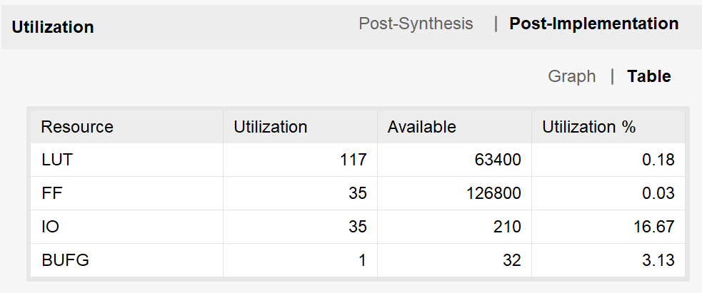
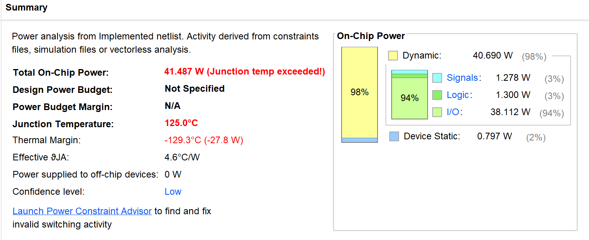
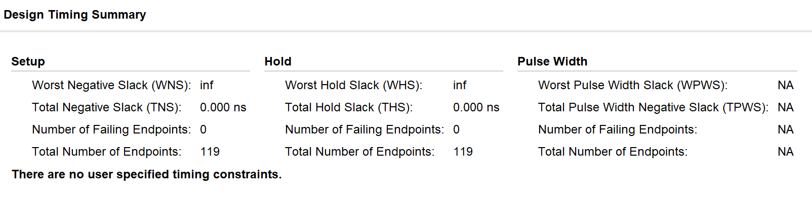
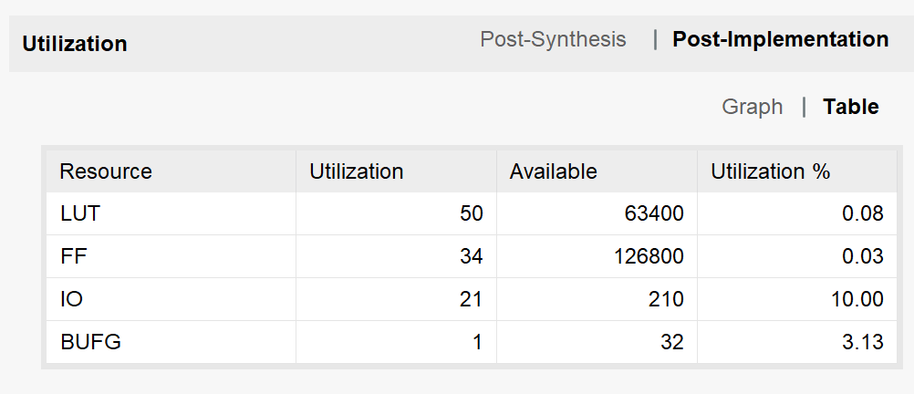
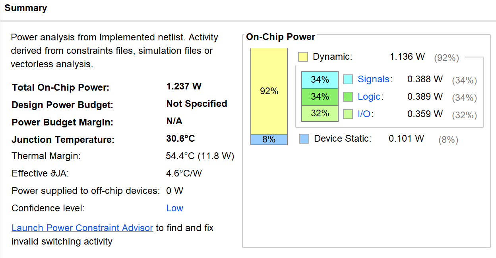
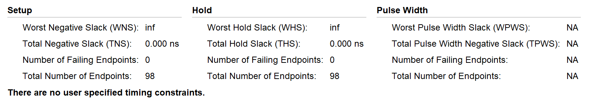
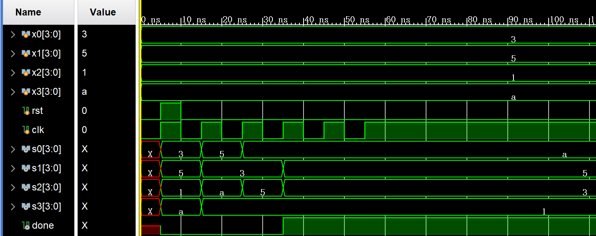
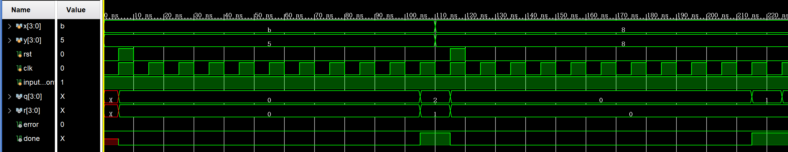

# **计算机组成原理实验报告**

+   **实验题目：数据通路与状态机 **
+   **实验日期：2019年3月29日**
+   **姓名：张劲暾**
+   **学号：PB16111485**
+   **成绩：**

---

## 实验目的：

1.  排序：s0 ~ s3是x0 ~ x3的排序结果
2.  除法运算：x / y = q … r

## 实验设计简述与核心代码：

### 四数排序单元设计（SORT.v）

```verilog
module SORT(
    //====================================================================
    input [3:0] x0,
    input [3:0] x1,
    input [3:0] x2,
    input [3:0] x3,
    input rst,
    input clk,
    //====================================================================
    output reg [3:0] s0,
    output reg [3:0] s1,
    output reg [3:0] s2,
    output reg [3:0] s3,
    output reg done
    //====================================================================
    );
    reg [1:0] cmp_count;
    // cmp_count
    always@(posedge clk or posedge rst)	// 状态机，3种状态
        begin
            if(rst)
                begin
                    cmp_count <= 2'b00;
                    done <= 0;
                end
            else if(cmp_count == 2'b10)
                begin
                    cmp_count <= 2'b00;
                    done <= 1;
                end
            else
                begin
                    cmp_count <= cmp_count + 2'b01;
                end
        end
    //====================================================================
    // compare
    always@(posedge clk or posedge rst)
        begin
            if(rst)
                begin
                    {s0[3:0],s1[3:0],s2[3:0],s3[3:0]} <= {x0[3:0],x1[3:0],x2[3:0],x3[3:0]};
                end
            else
                begin
                    case(cmp_count)
                        2'b00:				// 状态一，1-2比较，3-4比较
                            begin
            	 {s0[3:0], s1[3:0]} <= (s0[3:0] > s1[3:0]) ? {s0[3:0], s1[3:0]} : {s1[3:0], s0[3:0]};
               	 {s2[3:0], s3[3:0]} <= (s2[3:0] > s3[3:0]) ? {s2[3:0], s3[3:0]} : {s3[3:0], s2[3:0]};
                            end
                        2'b01:				// 状态二，1-3比较，2-4比较
                            begin
                   {s0[3:0], s2[3:0]} <= (s0[3:0] > s2[3:0]) ? {s0[3:0], s2[3:0]} : {s2[3:0], s0[3:0]};
                   {s1[3:0], s3[3:0]} <= (s1[3:0] > s3[3:0]) ? {s1[3:0], s3[3:0]} : {s3[3:0], s1[3:0]};
                            end
                        2'b10:				// 状态三，2-3比较
                            begin
                   {s1[3:0], s2[3:0]} <= (s1[3:0] > s2[3:0]) ? {s1[3:0], s2[3:0]} : {s2[3:0], s1[3:0]};
                            end
                    endcase
                end
        end
    //====================================================================
endmodule
```


### 除法器设计(DIV.v)

```verilog
module DIV(
    input[3:0] x,
    input[3:0] y,
    input rst,
    input clk,
    input input_confer,
    output reg [3:0] q,
    output reg [3:0] r,
    output reg error,
    output reg done
);
    reg [3:0] tempx;
    reg [3:0] tempy;
    reg [7:0] temp_x;
    reg [7:0] temp_y;
    reg [3:0] div_count;	// 状态计数
    reg div_on_going;		// 运行标志，对应结束标志done
    //-----------------------------------------------
    //division vaild
    always@(*) 
        begin
            error = ~(|y);
        end
    //-----------------------------------------------
    //operator store
    always@(posedge clk or posedge rst)
        begin
            if(rst)                 begin   tempx <= 4'b0;  tempy <= 4'b0;  end
            else if(input_confer)   begin   tempx <= x;     tempy <= y;     end
            else                    begin   tempx <= tempx; tempy <= tempy; end
        end
    //-----------------------------------------------
    //division on going flag
    always@(posedge clk or posedge rst)
        begin
            if(rst)
                begin
                    div_on_going <= 1'b0;
                    done <= 1'b0;
                end
            else if(input_confer && div_on_going == 1'b0)// 状态机，八种状态，四个移位，四个比较-减法，交替出现
                div_on_going <= 1'b1;
            else if(div_count == 4'd8)
                begin
                    div_on_going <= 1'b0;
                    done <= 1'b1;
                end
            else
                div_on_going <= div_on_going;
        end
    //-----------------------------------------------
    //division counter
    always@(posedge clk or posedge rst)
        begin
            if(rst)                 div_count <= 4'b0;
            else if(div_on_going)   div_count <= div_count + 4'b1;
            else                    div_count <= 4'b0;
        end
    //------------------------------------------------
    //division
    always@(posedge clk or posedge rst)
        begin
            if(rst)
                begin
                    temp_x = 8'b0;
                    temp_y = 8'b0;
                end
            else if(div_on_going)
                begin
                    if(div_count == 4'b0)					// 四个移位状态
                        begin
                            temp_x <= {4'b0,tempx};
                            temp_y <= {tempy,4'b0};
                        end
                    else if(div_count[0] == 1'b1)			// 四个比较-减法状态
                        temp_x <= {temp_x[6:0],1'b0};
                    else
                        temp_x <= (temp_x[7:4] >= temp_y[7:4]) ? (temp_x - temp_y + 1) : temp_x;
                end
            else
                begin
                    temp_x = 8'b0;
                    temp_y = 8'b0;
                end
        end
    //------------------------------------------------
    //result output
    always@(posedge done or posedge clk or posedge rst)
        begin
            if(rst)
                begin
                    q = 4'b0;
                    r = 4'b0;
                end
            else if(done)
                begin
                    q = temp_x[3:0];
                    r = temp_x[7:4];
                end
            else
                begin
                    q = 4'b0;
                    r = 4'b0;
                end
        end
    //------------------------------------------------
endmodule

```

## 实验结果：

### 现场烧录检查：已通过

### 实现资源消耗与性能统计：

#### SORT:







#### DIV:







### 仿真测试结果：

#### SORT仿真（test_sort.v）

```verilog
module test_sort(

    );
    reg [3:0] x0,x1,x2,x3;
    reg rst,clk;
    wire [3:0] s0,s1,s2,s3;
    wire done;
    SORT s(.x0(x0),.x1(x1),.x2(x2),.x3(x3),.rst(rst),.clk(clk),.s0(s0),.s1(s1),.s2(s2),.s3(s3),.done(done));
    initial
        begin
            x0 = 4'd3;
            x1 = 4'd5;
            x2 = 4'd1;
            x3 = 4'd10;
            rst = 0;
            clk = 0;
            #5
            rst = 1;
            clk = 1;
            #5
            rst = 0;
            clk = 0;
            #5
            clk = 1;
            #5
            clk = 0;
            #5
            clk = 1;
            #5
            clk = 0;
            #5
            clk = 1;
            #5
            clk = 0;
            #5
            clk = 1;
            #5
            clk = 0;
            #5
            clk = 1;
        end
endmodule

```

**结果正确：**



#### DIV仿真（test_div.v）

``` verilog
module test_div(

    );
    reg [3:0] x,y;
    reg rst;
    reg clk;
    reg input_confer;
    wire [3:0] q,r;
    wire error, done;
    DIV d(.x(x), .y(y), .rst(rst), .clk(clk), .input_confer(input_confer), .q(q), .r(r), .error(error), .done(done));
    initial
        begin
            x = 4'd11; // 测试 11 / 5 = 2 ... 1
            y = 4'd5;
            input_confer = 1;
            clk = 0;
            rst = 0;
            #5
            clk = 1;
            rst = 1;
            #5
            clk = 0;
            rst = 0;
            #5
            clk = 1;
            #5
            clk = 0;
            #5
            clk = 1;
            #5
            clk = 0;
            #5
            clk = 1;
            #5
            clk = 0;
            #5
            clk = 1;
            #5
            clk = 0;
            #5
            clk = 1;
            #5
            clk = 0;
            #5
            clk = 1;
            #5
            clk = 0;
            #5
            clk = 1;
            #5
            clk = 0;
            #5
            clk = 1;
            #5
            clk = 0;
            #5
            clk = 1;
            #5
            clk = 0;
            #5
            clk = 1;
            #5
            //=====================================
            x = 4'd8;	// 测试 8 / 8 = 1 ... 0
            y = 4'd8;
            clk = 0;
            rst = 0;
            #5
            clk = 1;
            rst = 1;
            #5
            clk = 0;
            rst = 0;
            #5
            clk = 1;
            #5
            clk = 0;
            #5
            clk = 1;
            #5
            clk = 0;
            #5
            clk = 1;
            #5
            clk = 0;
            #5
            clk = 1;
            #5
            clk = 0;
            #5
            clk = 1;
            #5
            clk = 0;
            #5
            clk = 1;
            #5
            clk = 0;
            #5
            clk = 1;
            #5
            clk = 0;
            #5
            clk = 1;
            #5
            clk = 0;
            #5
            clk = 1;
            #5
            clk = 0;
            #5
            clk = 1;
            #5
            clk = 0;
            #5
            clk = 1;
            #5
            clk = 0;
        end
endmodule
```


**结果正确：**



## 实验总结与感想：

1.  通过实验了解了数据通路与状态机的设计实现，了解了数据通路与状态机的简单应用。
2.  复习了Verilog语法，提高了编程实践能力。

