# **计算机组成原理实验报告**

+   **实验题目：流水线 MIPS-CPU **
+   **实验日期：2019年6月6日**
+   **姓名：张劲暾**
+   **学号：PB16111485**
+   **成绩：**

---

## 目录

[TOC]

---

## 实验目的：

1.  实现MIPS指令体系架构流水线CPU设计，实现流水线冲刷，气泡，旁路设计
2.  利用MIPS流水线CPU实现简单的计算机应用

## 实验设计简述与核心代码：

### CPU模块组成与数据通路设计

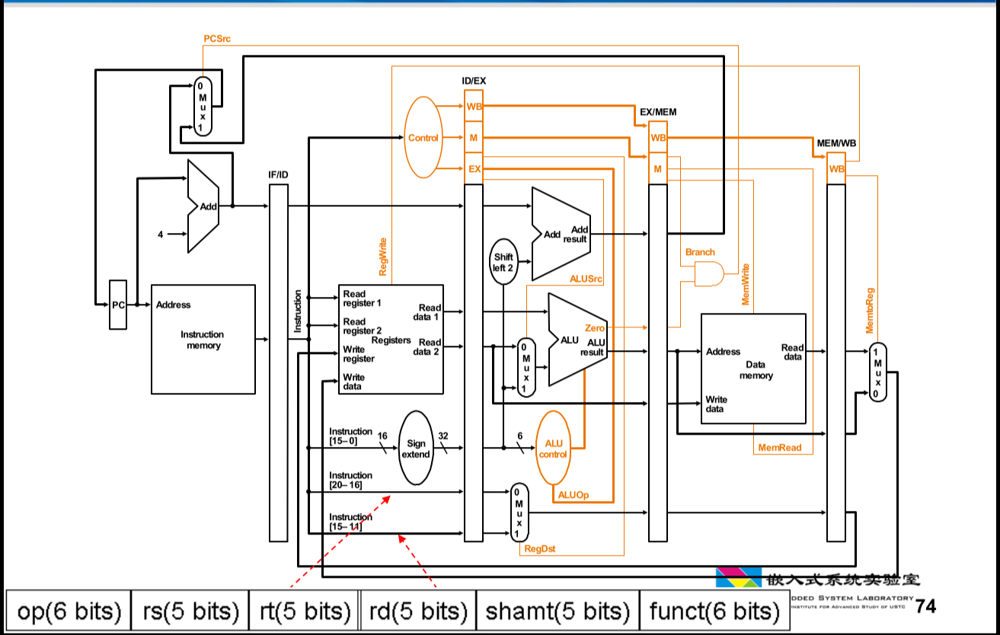

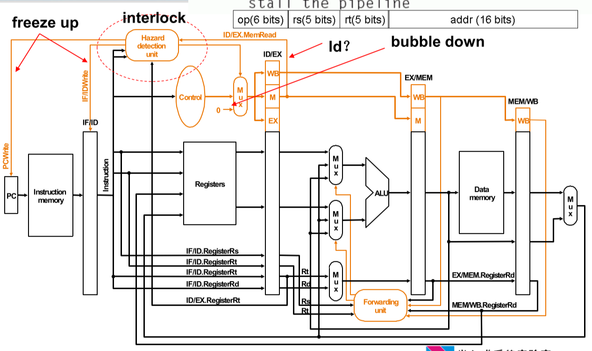

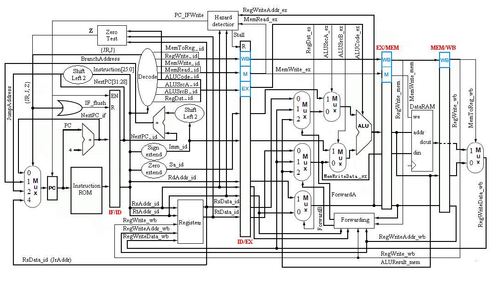


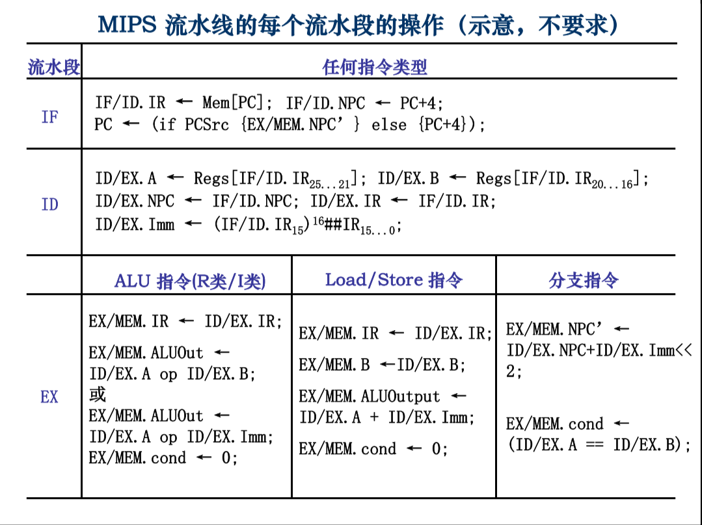

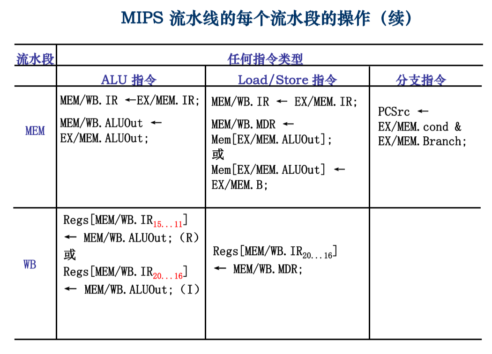

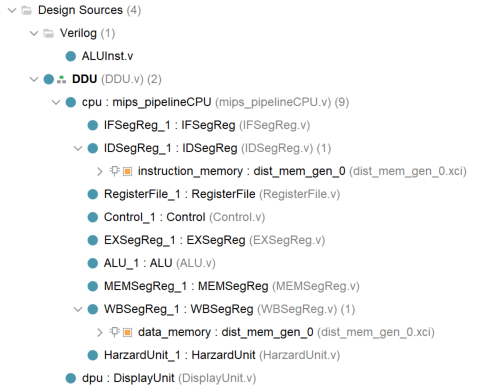

### `DDU`模块设计(DDU.v)

显示与调试控制模块，与Lab5中设计相同，不再赘述。

### `DisplayUnit`模块设计(DisplayUnit.v)

将CPU的输出值显示在数码管的译码模块，与Lab5中设计相同，不再赘述。

### `mips_pipelineCPU`模块设计(mips_pipelineCPU.v)

CPU顶层模块

```verilog
`timescale 1ns / 1ps
module mips_pipelineCPU (
//--------------------------------------------------------
    input           origin_clk,
    input           rst,
//--------------------------------------------------------
    input           run,
    input   [7:0]   addr,
    output  [31:0]  pc,
    output  [31:0]  mem_data,
    output  [31:0]  reg_data
//--------------------------------------------------------
);
//--------------------------------------------------------
wire clk;
assign clk = origin_clk & run;
//--------------------------------------------------------
wire        StallF;
wire        StallD;
wire        StallE;
wire        StallM;
wire        StallW;

wire        FlushF;
wire        FlushD;
wire        FlushE;
wire        FlushM;
wire        FlushW;

wire        RegDstD;
wire        RegDstE;
wire        RegWriteD;
wire        RegWriteE;
wire        RegWriteM;
wire        RegWriteW;
wire        ALUSrcAD;
wire        ALUSrcAE;
wire        MemReadD;
wire        MemReadE;
wire        MemWriteD;
wire        MemWriteE;
wire        MemWriteM;
wire        MemtoRegD;
wire        MemtoRegE;
wire        MemtoRegM;
wire        MemtoRegW;
wire        JumpD;
wire        Zero;
// wire        BranchE;
reg         BranchE;

// wire [31:0] PC_In;
reg  [31:0] PC_In;
wire [31:0] PCF;
wire [31:0] PCD;
wire [31:0] PCE;
wire [31:0] PCM;
wire [31:0] Instr;
wire [31:0] InstrE;
wire [31:0] InstrM;
wire [31:0] ImmD;
wire [31:0] ImmE;
wire [31:0] RF_RD1;
wire [31:0] RF_RD2;
wire [31:0] RegWriteDataW;
wire [31:0] RegDataAE;
wire [31:0] RegDataBE;
wire [31:0] ForwardDataA;
wire [31:0] ForwardDataB;
wire [31:0] StoreDataM;
wire [31:0] ALUOutE;
wire [31:0] ALUOutM;
wire [31:0] ResultW; 
wire [31:0] OperandA;
wire [31:0] OperandB;
wire [31:0] ReadDataW;

// wire [4:0]  RegWriteAddrW;

wire [4:0]  RegSourceAD;
wire [4:0]  RegSourceBD;
wire [4:0]  RegSourceAE;
wire [4:0]  RegSourceBE;
wire [4:0]  RegDestinationE;
wire [4:0]  RegDestinationM;
wire [4:0]  RegDestinationW;

wire [1:0]  RegReadD;
wire [1:0]  RegReadE;
wire [1:0]  ForwardAE;
wire [1:0]  ForwardBE;
wire [1:0]  ALUSrcBD;
wire [1:0]  ALUSrcBE;
wire [3:0]  ALUCtrlD;
wire [3:0]  ALUCtrlE;

wire [31:0] BrNPC;
wire [31:0] JumpNPC;
// reg  [31:0] PC_In;
//--------------------------------------------------------
assign pc               = PCF;
assign ImmD             = { {16{Instr[15]}}, Instr[15:0] };
assign JumpNPC          = { PCD[31:28], Instr[25:0], 2'b00 };
assign BrNPC            = PCE + 4 + ImmE * 4;
assign RegWriteDataW    = MemtoRegW     ? ReadDataW     : ResultW;
assign OperandA         = ALUSrcAE      ? ForwardDataA  : PCE;
assign OperandB         = ALUSrcBE[1]   ? ImmE          : ForwardDataB;
assign ForwardDataA     = ForwardAE[1]  ? ALUOutM       : 
    									( ForwardAE[0] ? RegWriteDataW : RegDataAE);
assign ForwardDataB     = ForwardBE[1]  ? ALUOutM       : 
    									( ForwardBE[0] ? RegWriteDataW : RegDataBE);
assign RegDestinationE  = RegDstE       ? InstrE[15:11] : InstrE[20:16];

parameter   OP_BEQ      = 6'b000_100;
parameter   OP_BNE      = 6'b000_101;

always @(*) begin
    if          ( InstrE[31:26] == OP_BEQ ) begin
        BranchE = ( OperandA == OperandB );
    end else if ( InstrE[31:26] == OP_BNE ) begin
        BranchE = ( OperandA != OperandB );
    end else begin
        BranchE = 1'b0;
    end
end

always @(*) begin
    /* if (rst) begin
        PC_In = 32'd200;
    end else  */if (BranchE) begin
        PC_In = BrNPC;
    end else if (JumpD) begin
        PC_In = JumpNPC;
    end else begin
        PC_In = PCF + 32'd4;
    end
end
//--------------------------------------------------------
IFSegReg IFSegReg_1 (
    .clk(clk),      /* input               clk,     */
    .rst(rst),      /* input               rst,     */
    .en(~StallF),   /* input               en,      */
    .PC_In(PC_In),  /* input   [31:0]      PC_In,   */
    .PC(PCF)        /* output  reg [31:0]  PC       */
);
//--------------------------------------------------------
IDSegReg IDSegReg_1 (
    .clk(clk),      /* input               clk,     */
    .rst(rst),      /* input               rst,     */
    .clear(FlushD), /* input               clear,   */
    .en(~StallD),   /* input               en,      */
    .Address(PCF),  /* input       [31:0]  Address, */
    .PCF(PCF),      /* input       [31:0]  PCF,     */
    .Inst(Instr),   /* output      [31:0]  Inst,    */
    .PCD(PCD)       /* output  reg [31:0]  PCD      */
);
//--------------------------------------------------------
RegisterFile RegisterFile_1 (
    .clk(clk),                  /* input               clk,         */
    .rst(rst),                  /* input               rst,         */
    .RegWrite(RegWriteW),       /* input               RegWrite,    */
    .ReadAddr1(Instr[25:21]),   /* input       [4:0]   ReadAddr1,   */
    .ReadData1(RF_RD1),         /* output      [31:0]  ReadData1,   */
    .ReadAddr2(Instr[20:16]),   /* input       [4:0]   ReadAddr2,   */
    .ReadData2(RF_RD2),         /* output      [31:0]  ReadData2,   */
 // .WriteAddr(RegWriteAddrW),  /* input       [4:0]   WriteAddr,   */
    .WriteAddr(RegDestinationW),/* input       [4:0]   WriteAddr,   */
    .WriteData(RegWriteDataW),  /* input       [31:0]  WriteData,   */
    .addr(addr[4:0]),           /* input       [4:0]   addr,        */
    .reg_data(reg_data)         /* output      [31:0]  reg_data     */
);
//--------------------------------------------------------
Control Control_1 (
    .clk(clk),              /* input               clk,         */
    .rst(rst),              /* input               rst,         */
    .Op(Instr[31:26]),      /* input       [5:0]   Op,          */
    .Func(Instr[5:0]),      /* input       [5:0]   Func,        */
    .RegDstD(RegDstD),      /* output              RegDstD,     */
    .RegWriteD(RegWriteD),  /* output              RegWriteD,   */
    .ALUSrcAD(ALUSrcAD),    /* output              ALUSrcAD,    */
    .ALUSrcBD(ALUSrcBD),    /* output      [1:0]   ALUSrcBD,    */
    .ALUCtrlD(ALUCtrlD),    /* output  reg [3:0]   ALUCtrlD,    */
    .MemReadD(MemReadD),    /* output              MemReadD,    */
    .MemWriteD(MemWriteD),  /* output              MemWriteD,   */
    .MemtoRegD(MemtoRegD),  /* output              MemtoRegD,   */
    .JumpD(JumpD),          /* output              JumpD        */
    .RegReadD(RegReadD)     /* output  reg [1:0]   RegReadD     */
);
//--------------------------------------------------------
EXSegReg EXSegReg_1 (
    .clk(clk),              /* input               clk,         */
    .en(~StallE),           /* input               en,          */
    .clear(FlushE),         /* input               clear,       */
    .PCD(PCD),              /* input       [31:0]  PCD,         */
    .PCE(PCE),              /* output  reg [31:0]  PCE,         */
    .ImmD(ImmD),            /* input       [31:0]  ImmD,        */
    .ImmE(ImmE),            /* output  reg [31:0]  ImmE,        */
    .InstrD(Instr),         /* input       [31:0]  InstrD,      */
    .InstrE(InstrE),        /* output  reg [31:0]  InstrE,      */
    .RegDataAD(RF_RD1),     /* input       [31:0]  RegDataAD,   */
    .RegDataAE(RegDataAE),  /* output  reg [31:0]  RegDataAE,   */
    .RegDataBD(RF_RD2),     /* input       [31:0]  RegDataBD,   */
    .RegDataBE(RegDataBE),  /* output  reg [31:0]  RegDataBE,   */
    .RegDstD(RegDstD),      /* input               RegDstD,     */
    .RegDstE(RegDstE),      /* output  reg         RegDstE,     */
    .RegWriteD(RegWriteD),  /* input               RegWriteD,   */
    .RegWriteE(RegWriteE),  /* output  reg         RegWriteE,   */
    .ALUSrcAD(ALUSrcAD),    /* input               ALUSrcAD,    */
    .ALUSrcAE(ALUSrcAE),    /* output  reg         ALUSrcAE,    */
    .ALUSrcBD(ALUSrcBD),    /* input       [1:0]   ALUSrcBD,    */
    .ALUSrcBE(ALUSrcBE),    /* output  reg [1:0]   ALUSrcBE,    */
    .MemReadD(MemReadD),    /* input               MemReadD,    */
    .MemReadE(MemReadE),    /* output  reg         MemReadE,    */
    .MemWriteD(MemWriteD),  /* input               MemWriteD,   */
    .MemWriteE(MemWriteE),  /* output  reg         MemWriteE,   */
    .MemtoRegD(MemtoRegD),  /* input               MemtoRegD,   */
    .MemtoRegE(MemtoRegE),  /* output  reg         MemtoRegE    */
    .ALUCtrlD(ALUCtrlD),    /* input       [3:0]   ALUCtrlD,    */
    .ALUCtrlE(ALUCtrlE),    /* output  reg [3:0]   ALUCtrlE     */
    .RegReadD(RegReadD),    /* input       [1:0]   RegReadD,    */
    .RegReadE(RegReadE)     /* output  reg [1:0]   RegReadE     */
);
//--------------------------------------------------------
ALU ALU_1 (
    .SourceA(OperandA), /* input       [31:0]  SourceA, */
    .SourceB(OperandB), /* input       [31:0]  SourceB, */
    .Ctrl(ALUCtrlE),    /* input       [3:0]   Ctrl,    */
    .ALUOut(ALUOutE),   /* output  reg [31:0]  ALUOut,  */
    .Zero(Zero)         /* output              Zero     */
);
//--------------------------------------------------------
MEMSegReg MEMSegReg_1 (
    .clk(clk),                          /* input               clk,             */
    .en(~StallM),                       /* input               en,              */
    .clear(FlushM),                     /* input               clear,           */
    .PCE(PCE),                          /* input       [31:0]  PCE,             */
    .PCM(PCM),                          /* output  reg [31:0]  PCM,             */
    .ForwardDataB(ForwardDataB),        /* input       [31:0]  ForwardDataB,    */
    .StoreDataM(StoreDataM),            /* output  reg [31:0]  StoreDataM,      */
    .ALUOutE(ALUOutE),                  /* input       [31:0]  ALUOutE,         */
    .ALUOutM(ALUOutM),                  /* output  reg [31:0]  ALUOutM,         */
    .InstrE(InstrE),                    /* input       [31:0]  InstrE,          */
    .InstrM(InstrM),                    /* output  reg [31:0]  InstrM,          */
    .RegWriteE(RegWriteE),              /* input               RegWriteE,       */
    .RegWriteM(RegWriteM),              /* output  reg         RegWriteM,       */
    .MemtoRegE(MemtoRegE),              /* input               MemtoRegE,       */
    .MemtoRegM(MemtoRegM),              /* output  reg         MemtoRegM,       */
    .MemWriteE(MemWriteE),              /* input               MemWriteE,       */
    .MemWriteM(MemWriteM),              /* output  reg         MemWriteM        */
    .RegDestinationE(RegDestinationE),  /* input        [4:0]  RegDestinationE, */
    .RegDestinationM(RegDestinationM)   /* output  reg  [4:0]  RegDestinationM  */
);
//--------------------------------------------------------
WBSegReg WBSegReg_1 (
    .clk(clk),                          /* input               clk,             */
    .en(~StallW),                       /* input               en,              */
    .clear(FlushW),                     /* input               clear,           */
    .Address(ALUOutM),                  /* input       [31:0]  Address,         */
    .WriteData(StoreDataM),             /* input       [31:0]  WriteData,       */
    .WriteEn(MemWriteM),                /* input       [31:0]  WriteEn,         */
    .ReadData(ReadDataW),               /* output      [31:0]  ReadData,        */
    .addr(addr),                        /* input       [7:0]   addr,            */
    .mem_data(mem_data),                /* output      [31:0]  mem_data,        */
    .ResultM(ALUOutM),                  /* input       [31:0]  ResultM,         */
    .ResultW(ResultW),                  /* output  reg [31:0]  ResultW,         */
    .RegDestinationM(RegDestinationM),  /* input       [4:0]   RegDestinationM, */
    .RegDestinationW(RegDestinationW),  /* output  reg [4:0]   RegDestinationW, */
    .RegWriteM(RegWriteM),              /* input               RegWriteM,       */
    .RegWriteW(RegWriteW),              /* output  reg         RegWriteW,       */
    .MemtoRegM(MemtoRegM),              /* input               MemtoRegM,       */
    .MemtoRegW(MemtoRegW)               /* output  reg         MemtoRegW        */
);
//--------------------------------------------------------
HarzardUnit HarzardUnit_1 (
    .rst(rst),                          /* input               rst,             */
    .BranchE(BranchE),                  /* input               BranchE,         */
    .JumpD(JumpD),                      /* input               JumpD,           */
    .RegSourceAD(Instr[25:21]),         /* input       [4:0]   RegSourceAD,     */ 
    .RegSourceBD(Instr[20:16]),         /* input       [4:0]   RegSourceBD,     */
    .RegSourceAE(InstrE[25:21]),        /* input       [4:0]   RegSourceAE,     */ 
    .RegSourceBE(InstrE[20:16]),        /* input       [4:0]   RegSourceBE,     */
    .RegDestinationE(RegDestinationE),  /* input       [4:0]   RegDestinationE, */
    .RegDestinationM(RegDestinationM),  /* input       [4:0]   RegDestinationM, */
    .RegDestinationW(RegDestinationW),  /* input       [4:0]   RegDestinationW, */
    .RegReadE(RegReadE),                /* input       [1:0]   RegReadE,        */
    .MemtoRegE(MemtoRegE),              /* input               MemtoRegE,       */
    .RegWriteM(RegWriteM),              /* input               RegWriteM,       */
    .RegWriteW(RegWriteW),              /* input               RegWriteW,       */
    .StallF(StallF),                    /* output  reg         StallF,          */ 
    .StallD(StallD),                    /* output  reg         StallD,          */ 
    .StallE(StallE),                    /* output  reg         StallE,          */ 
    .StallM(StallM),                    /* output  reg         StallM,          */ 
    .StallW(StallW),                    /* output  reg         StallW,          */
    .FlushF(FlushF),                    /* output  reg         FlushF,          */ 
    .FlushD(FlushD),                    /* output  reg         FlushD,          */ 
    .FlushE(FlushE),                    /* output  reg         FlushE,          */ 
    .FlushM(FlushM),                    /* output  reg         FlushM,          */ 
    .FlushW(FlushW),                    /* output  reg         FlushW,          */
    .ForwardAE(ForwardAE),              /* output  reg [1:0]   ForwardAE,       */ 
    .ForwardBE(ForwardBE)               /* output  reg [1:0]   ForwardBE        */
);
//--------------------------------------------------------
endmodule
```

### `IFSegReg`模块设计(IFSegReg.v)

IF段寄存器

```verilog
`timescale 1ns / 1ps
module IFSegReg (
//--------------------------------------------------------
    input               clk,
    input               rst,
    input               en,
    input   [31:0]      PC_In,
//--------------------------------------------------------
    output  reg [31:0]  PC
//--------------------------------------------------------
);

always @(posedge clk or posedge rst) begin
    if (rst) begin
        PC <= 32'd200;
    end else begin
        if (en) begin
            PC <= PC_In;
        end else begin
            PC <= PC;
        end
    end
end

endmodule
```

### `IDSegReg`模块设计(IDSegReg.v)

ID段寄存器

```verilog
`timescale 1ns / 1ps
module IDSegReg (
//--------------------------------------------------------
    input               clk,
    input               rst,
    input               clear,
    input               en,
    input       [31:0]  Address,
    input       [31:0]  PCF,
//--------------------------------------------------------
    output  reg [31:0]  Inst,
    output  reg [31:0]  PCD
//--------------------------------------------------------
);

reg             stallOrClear;
reg     [31:0]  stallOrClearData;
wire    [31:0]  InstRaw;

// assign Inst = stallOrClear ? stallOrClearData : InstRaw;
always @(posedge clk) begin
    Inst <= stallOrClear ? stallOrClearData : InstRaw;
end
always @(posedge clk or posedge rst) begin
    if (rst) begin
        stallOrClear        <= 1'b0;
        stallOrClearData    <= 32'b0;
    end else begin
        if (~en) begin
            stallOrClear        <= 1'b1;
            stallOrClearData    <= Inst;
        end else if (clear) begin
            stallOrClear        <= 1'b1;
            stallOrClearData    <= 32'b0;
        end else begin
            stallOrClear        <= 1'b0;
            stallOrClearData    <= 32'b0;
        end
    end
end

always @(posedge clk or posedge rst) begin
    if (rst) begin
        PCD <= 32'b0;
    end else begin
        PCD <= clear ? 32'b0 : PCF;
    end
end

dist_mem_gen_0 instruction_memory (
  .a(Address[9:2]), // input wire [7 : 0] a
  .d(32'b0),        // input wire [31 : 0] d
  .dpra(8'b0),      // input wire [7 : 0] dpra
  .clk(clk),        // input wire clk
  .we(1'b0),        // input wire we
  .spo(InstRaw),    // output wire [31 : 0] spo
  .dpo(dpo)         // output wire [31 : 0] dpo
);
endmodule
```

### `Control`模块设计(Control.v)

逻辑电路，生成ID段指令对应的各种控制信号

```verilog
`timescale 1ns / 1ps
module Control (
//----------------------------------------------------------------------------
    input               clk,
    input               rst,
//----------------------------------------------------------------------------
    input       [5:0]   Op,             // 六位操作码
    input       [5:0]   Func,
    output              RegDstD,        // 选择 rd(1) 或 rt(0) 作为写操作的目的寄存器
    output              RegWriteD,      // 寄存器写信号
    output              ALUSrcAD,       // 1 - 寄存器，0 - PC
    output      [1:0]   ALUSrcBD,       // 00 - 寄存器，01 - 4，10 - 32位立即数符号扩展，11 - 32位立即数符号扩展左移两位
    output  reg [3:0]   ALUCtrlD,       // ALU控制信号
    output              MemReadD,       // 读内存
    output              MemWriteD,      // 写内存
    output              MemtoRegD,      // 内存到寄存器
    output              JumpD,          //
    output  reg [1:0]   RegReadD
//----------------------------------------------------------------------------
    );
//----------------------------------------------------------------------------
parameter   OP_J        = 6'b000_010;
parameter   OP_R_TYPE   = 6'b000_000;

parameter   OP_ADDI     = 6'b001_000;
parameter   OP_SLTI     = 6'b001_010;
parameter   OP_ANDI     = 6'b001_100;
parameter   OP_ORI      = 6'b001_101;
parameter   OP_XORI     = 6'b001_110;

parameter   OP_BEQ      = 6'b000_100;
parameter   OP_BNE      = 6'b000_101;
parameter   OP_LW       = 6'b100_011;
parameter   OP_SW       = 6'b101_011;

assign RegDstD      = ( Op == OP_R_TYPE );
assign RegWriteD    = ( Op == OP_R_TYPE ) | ( Op[5:3] == 3'b001 ) | ( Op == OP_LW );
assign ALUSrcAD     = 1'b1;                 // 这里先设为0
assign ALUSrcBD     = ( Op == OP_R_TYPE ) ? 2'b00 : 2'b10;
assign MemtoRegD    = ( Op == OP_LW     );
assign MemReadD     = ( Op == OP_LW     );
assign MemWriteD    = ( Op == OP_SW     );
assign JumpD        = ( Op == OP_J      );

always @(*) begin
    RegReadD[0] <=     ( Op == OP_R_TYPE ) 
                    || ( Op == OP_LW 	 ) 
                    || ( Op == OP_BEQ    )
                    || ( Op == OP_BNE    ) 
                    || ( Op == OP_SW     ) 
    				|| ( Op[5:3] == 3'b001 );
    RegReadD[1] <=     ( Op == OP_R_TYPE ) 
                    || ( Op == OP_BEQ    )
                    || ( Op == OP_BNE    ) 
                    || ( Op == OP_SW     );
end

// always @ (posedge clk) begin
always @ (*) begin
    if ( Op == OP_BEQ || Op == OP_BNE ) begin
                            ALUCtrlD = `ALU_SUB;
    end else if ( Op == OP_LW || Op == OP_SW ) begin
                            ALUCtrlD = `ALU_ADD;
    end else if ( Op == OP_R_TYPE ) begin
        case (Func)
            `FUNC_ADD   :   ALUCtrlD = `ALU_ADD;
            `FUNC_SUB   :   ALUCtrlD = `ALU_SUB;
            `FUNC_SLT   :   ALUCtrlD = `ALU_LT;
            `FUNC_AND   :   ALUCtrlD = `ALU_AND;
            `FUNC_OR    :   ALUCtrlD = `ALU_OR;
            `FUNC_XOR   :   ALUCtrlD = `ALU_XOR;
            `FUNC_NOR   :   ALUCtrlD = `ALU_NOR;
            default     :   ALUCtrlD = 4'b1111;
        endcase
    end else if ( Op[5:3] == 3'b001 ) begin
        case (Op)
            `FUNC_ADDI  :   ALUCtrlD = `ALU_ADD;
            `FUNC_SLTI  :   ALUCtrlD = `ALU_LT;
            `FUNC_ANDI  :   ALUCtrlD = `ALU_AND;
            `FUNC_ORI   :   ALUCtrlD = `ALU_OR;
            `FUNC_XORI  :   ALUCtrlD = `ALU_XOR;
            default     :   ALUCtrlD = 4'b1111;
        endcase
    end else begin
                            ALUCtrlD = 4'b1111;
    end
end

//-----------------------------------------------------------------------
endmodule
```

### `RegisterFile`模块设计(RegisterFile.v)

寄存器文件

```verilog
`timescale 1ns / 1ps
module RegisterFile (
//----------------------------------------
    input               clk,
    input               rst,
//----------------------------------------
    input               RegWrite,
    input       [4:0]   ReadAddr1,
    output      [31:0]  ReadData1,
    input       [4:0]   ReadAddr2,
    output      [31:0]  ReadData2,
    input       [4:0]   WriteAddr,
    input       [31:0]  WriteData,
//----------------------------------------
    input       [4:0]   addr,
    output      [31:0]  reg_data
//----------------------------------------
    );
//----------------------------------------
reg [31:0]  registers[0:31];
assign ReadData1 = registers[ReadAddr1];
assign ReadData2 = registers[ReadAddr2];
assign reg_data  = registers[addr];
integer i;
//----------------------------------------
always@(posedge clk or posedge rst)
    begin
        if(rst) for (i = 0; i < 32; i = i + 1)  
            begin registers[i][31:0] <= 32'd0;          end
        else    if(RegWrite)                    
            begin registers[WriteAddr] <= WriteData;    end
    end
//----------------------------------------
endmodule
```

### `ALUInst`参数设定(ALUInst.v)

算数逻辑运算参数设定

```verilog
`define ALU_AND 4'b0000
`define ALU_OR  4'b0001
`define ALU_ADD 4'b0010
`define ALU_SUB 4'b0110
`define ALU_LT  4'b0111
`define ALU_NOR 4'b1100

`define ALU_XOR 4'b1000

`define FUNC_ADD    6'b100_000
`define FUNC_SUB    6'b100_010
`define FUNC_SLT    6'b101_010
`define FUNC_AND    6'b100_100
`define FUNC_OR     6'b100_101
`define FUNC_XOR    6'b100_110
`define FUNC_NOR    6'b100_111

`define FUNC_ADDI   6'b001_000
`define FUNC_SLTI   6'b001_010
`define FUNC_ANDI   6'b001_100
`define FUNC_ORI    6'b001_101
`define FUNC_XORI   6'b001_110
```

### `EXSegReg`模块设计(EXSegReg.v)

EXE段寄存器

```verilog
`timescale 1ns / 1ps
module EXSegReg (
//--------------------------------------------------------
    input               clk,
    input               en,
    input               clear,
//--------------------------------------------------------
    input       [31:0]  PCD,
    output  reg [31:0]  PCE,
    input       [31:0]  ImmD,
    output  reg [31:0]  ImmE,
    input       [31:0]  InstrD,
    output  reg [31:0]  InstrE,
    input       [31:0]  RegDataAD,
    output  reg [31:0]  RegDataAE,
    input       [31:0]  RegDataBD,
    output  reg [31:0]  RegDataBE,

    input               RegDstD,
    output  reg         RegDstE,
    input               RegWriteD,
    output  reg         RegWriteE,
    input               ALUSrcAD,
    output  reg         ALUSrcAE,
    input       [1:0]   ALUSrcBD,
    output  reg [1:0]   ALUSrcBE,
    input               MemReadD,
    output  reg         MemReadE,
    input               MemWriteD,
    output  reg         MemWriteE,
    input               MemtoRegD,
    output  reg         MemtoRegE,
    input       [3:0]   ALUCtrlD,
    output  reg [3:0]   ALUCtrlE,
    input       [1:0]   RegReadD,
    output  reg [1:0]   RegReadE
//--------------------------------------------------------
);
always @(posedge clk) begin
    if (en) begin
        if (clear) begin
            PCE         <= 32'b0;
            ImmE        <= 32'b0;
            InstrE      <= 32'b0;
            RegDataAE   <= 32'b0;
            RegDataBE   <= 32'b0;

            RegDstE     <= 1'b0;
            RegWriteE   <= 1'b0;
            ALUSrcAE    <= 1'b0;
            ALUSrcBE    <= 2'b00;
            MemReadE    <= 1'b0;
            MemWriteE   <= 1'b0;
            MemtoRegE   <= 1'b0;
            ALUCtrlE    <= 4'b0;
            RegReadE    <= 2'b00;
        end else begin
            PCE         <= PCD;
            ImmE        <= ImmD;
            InstrE      <= InstrD;
            RegDataAE   <= RegDataAD;
            RegDataBE   <= RegDataBD;

            RegDstE     <= RegDstD;
            RegWriteE   <= RegWriteD;
            ALUSrcAE    <= ALUSrcAD;
            ALUSrcBE    <= ALUSrcBD;
            MemReadE    <= MemReadD;
            MemWriteE   <= MemWriteD;
            MemtoRegE   <= MemtoRegD;
            ALUCtrlE    <= ALUCtrlD;
            RegReadE    <= RegReadD;
        end
    end
end
endmodule

```

### `ALU`模块设计(ALU.v)

算术逻辑运算模块

```verilog
`timescale 1ns / 1ps
`include "ALUInst.v" 
module ALU (
//----------------------------------------
    input       [31:0]  SourceA,
    input       [31:0]  SourceB,
    input       [3:0]   Ctrl,
    output  reg [31:0]  ALUOut,
    output              Zero    //
//----------------------------------------
    );
//----------------------------------------
assign Zero = (ALUOut == 0);
always@(*)
    begin
        case (Ctrl)
            `ALU_AND    : ALUOut <= SourceA & SourceB;
            `ALU_OR     : ALUOut <= SourceA | SourceB;
            `ALU_ADD    : ALUOut <= SourceA + SourceB;
            `ALU_SUB    : ALUOut <= SourceA - SourceB;
            `ALU_LT     : ALUOut <= SourceA < SourceB;
            `ALU_NOR    : ALUOut <= ~(SourceA | SourceB);
            `ALU_XOR    : ALUOut <= SourceA ^ SourceB;
            default     : ALUOut <= 32'b0;
        endcase
    end
//----------------------------------------
endmodule
```

### `MEMSegReg`模块设计(MEMSegReg.v)

MEM段寄存器

```verilog
`timescale 1ns / 1ps
module MEMSegReg (
//--------------------------------------------------------
    input               clk,
    input               en,
    input               clear,
//--------------------------------------------------------
    input       [31:0]  PCE,
    output  reg [31:0]  PCM,
    input       [31:0]  ForwardDataB,
    output  reg [31:0]  StoreDataM,
    input       [31:0]  ALUOutE,
    output  reg [31:0]  ALUOutM,
    input       [31:0]  InstrE,
    output  reg [31:0]  InstrM,

    input               RegWriteE,
    output  reg         RegWriteM,
    input               MemtoRegE,
    output  reg         MemtoRegM,
    input               MemWriteE,
    output  reg         MemWriteM,
    input       [4:0]   RegDestinationE,
    output  reg [4:0]   RegDestinationM
//--------------------------------------------------------
);
always @(posedge clk) begin
    if (en) begin
        if (clear) begin
            PCM             <= 32'b0;
            ALUOutM         <= 32'b0;
            StoreDataM      <= 32'b0;
            InstrM          <= 32'b0;
            RegWriteM       <= 1'b0;
            MemtoRegM       <= 1'b0;
            MemWriteM       <= 1'b0;
            RegDestinationM <= 1'b0;
        end else begin
            PCM             <= PCE;
            ALUOutM         <= ALUOutE;
            StoreDataM      <= ForwardDataB;
            InstrM          <= InstrE;
            RegWriteM       <= RegWriteE;
            MemtoRegM       <= MemtoRegE;
            MemWriteM       <= MemWriteE;
            RegDestinationM <= RegDestinationE;
        end
    end
end
endmodule

```

### `WBSegReg`模块设计(WBSegReg.v)

WB段寄存器

```verilog
`timescale 1ns / 1ps
module WBSegReg (
//--------------------------------------------------------
    input               clk,
    input               en,
    input               clear,
//--------------------------------------------------------
    input       [31:0]  Address,
    input       [31:0]  WriteData,
    input       [31:0]  WriteEn,
    output      [31:0]  ReadData,
    input       [7:0]   addr,
    output      [31:0]  mem_data,
    input       [31:0]  ResultM,
    output  reg [31:0]  ResultW,
    input       [4:0]   RegDestinationM,
    output  reg [4:0]   RegDestinationW,
    input               RegWriteM,
    output  reg         RegWriteW,
    input               MemtoRegM,
    output  reg         MemtoRegW
//--------------------------------------------------------
);

always @(posedge clk) begin
    if (en) begin
        if (clear) begin
            RegWriteW       <= 1'b0;
            MemtoRegW       <= 1'b0;
            RegDestinationW <= 5'b0;
            ResultW         <= 32'b0;
        end else begin
            RegWriteW       <= RegWriteM;
            MemtoRegW       <= MemtoRegM;
            RegDestinationW <= RegDestinationM;
            ResultW         <= ResultM;
        end
    end
end

wire [31:0] ReadData_Raw;
dist_mem_gen_0 data_memory (
    .a(Address[9:2]),   // input wire [7 : 0] a
    .d(WriteData),      // input wire [31 : 0] d
    .dpra(addr),        // input wire [7 : 0] dpra
    .clk(clk),          // input wire clk
    .we(WriteEn),       // input wire we
    .spo(ReadData),     // output wire [31 : 0] spo
    .dpo(mem_data)      // output wire [31 : 0] dpo
);

reg         stall_buf;
reg         clear_buf;
reg [31:0]  ReadData_Old;
always @(posedge clk) begin
    stall_buf       <= ~en;
    clear_buf       <= clear;
    ReadData_Old    <= ReadData_Raw;
end

assign ReadData = stall_buf ? ReadData_Old : 
                            ( clear_buf ? 32'b0 : ReadData_Raw);

endmodule
```

### `HarzardUnit`模块设计(HarzardUnit.v)

气泡，冲刷和旁路信号控制模块

```verilog
`timescale 1ns / 1ps
module HarzardUnit (
//--------------------------------------------------------
    input               rst,
    input               BranchE,
    input               JumpD,
    input       [4:0]   RegSourceAD, 
    input       [4:0]   RegSourceBD,
    input       [4:0]   RegSourceAE, 
    input       [4:0]   RegSourceBE,
    input       [4:0]   RegDestinationE,
    input       [4:0]   RegDestinationM,
    input       [4:0]   RegDestinationW,
    input       [1:0]   RegReadE,   // 两个源寄存器的使用情况
    input               MemtoRegE,
    input               RegWriteM,
    input               RegWriteW,
//--------------------------------------------------------
    output  reg         StallF, 
    output  reg         StallD, 
    output  reg         StallE, 
    output  reg         StallM, 
    output  reg         StallW,
    output  reg         FlushF, 
    output  reg         FlushD, 
    output  reg         FlushE, 
    output  reg         FlushM, 
    output  reg         FlushW,
    output  reg [1:0]   ForwardAE, 
    output  reg [1:0]   ForwardBE
//--------------------------------------------------------
);
//--------------------------------------------------------
always @(*) begin
    if (rst) begin
        StallF <= 1'b0; FlushF <= 1'b1;
        StallD <= 1'b0; FlushD <= 1'b1;
        StallE <= 1'b0; FlushE <= 1'b1;
        StallM <= 1'b0; FlushM <= 1'b1;
        StallW <= 1'b0; FlushW <= 1'b1;
    end else if (   MemtoRegE && 
                    RegDestinationE != 5'b0 && 
                    ( RegDestinationE == RegSourceAD 
                   || RegDestinationE == RegSourceBD ) 
                ) begin
        StallF <= 1'b1; FlushF <= 1'b0;
        StallD <= 1'b1; FlushD <= 1'b0;
        StallE <= 1'b0; FlushE <= 1'b0;
        StallM <= 1'b0; FlushM <= 1'b0;
        StallW <= 1'b0; FlushW <= 1'b0;
    end else if (BranchE) begin
        StallF <= 1'b0; FlushF <= 1'b0;
        StallD <= 1'b0; FlushD <= 1'b1;
        StallE <= 1'b0; FlushE <= 1'b1;
        StallM <= 1'b0; FlushM <= 1'b0;
        StallW <= 1'b0; FlushW <= 1'b0;
    end else if (JumpD) begin
        StallF <= 1'b0; FlushF <= 1'b0;
        StallD <= 1'b0; FlushD <= 1'b1;
        StallE <= 1'b0; FlushE <= 1'b0;
        StallM <= 1'b0; FlushM <= 1'b0;
        StallW <= 1'b0; FlushW <= 1'b0;
    end begin
        StallF <= 1'b0; FlushF <= 1'b0;
        StallD <= 1'b0; FlushD <= 1'b0;
        StallE <= 1'b0; FlushE <= 1'b0;
        StallM <= 1'b0; FlushM <= 1'b0;
        StallW <= 1'b0; FlushW <= 1'b0;
    end
end
//--------------------------------------------------------
always @(*) begin
    if          ( RegReadE[0] 
                 && RegWriteM 
                 && RegDestinationM != 5'b0 
                 && RegDestinationM == RegSourceAE
                ) begin
        ForwardAE <= 2'b10;
    end else if ( RegReadE[0] 
                 && RegWriteW 
                 && RegDestinationW != 5'b0 
                 && RegDestinationW == RegSourceAE
                ) begin
        ForwardAE <= 2'b01;
    end else begin
        ForwardAE <= 2'b00;
    end
end
//--------------------------------------------------------
always @(*) begin
    if          ( RegReadE[1] 
                 && RegWriteM 
                 && RegDestinationM != 5'b0 
                 && RegDestinationM == RegSourceBE
                ) begin
        ForwardBE <= 2'b10;
    end else if ( RegReadE[1] 
                 && RegWriteW 
                 && RegDestinationW != 5'b0 
                 && RegDestinationW == RegSourceBE
                ) begin
        ForwardBE <= 2'b01;
    end else begin
        ForwardBE <= 2'b00;
    end
end
//--------------------------------------------------------
endmodule

```

## 实验结果：

### 现场烧录检查：已通过

### 实现资源消耗与性能统计：

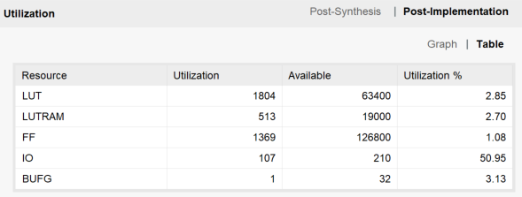

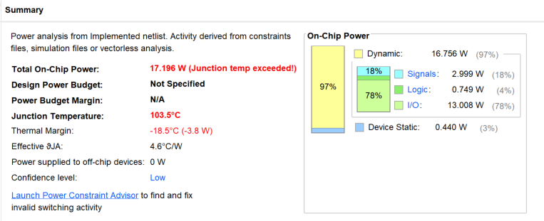

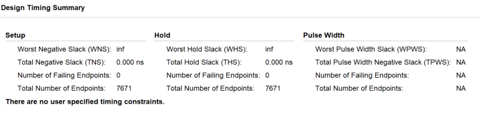

### 仿真测试结果：

#### 应用设计：斐波那契数列前20项的计算

```assembly
j _start
# 计算斐波那契数列的前 20 项并保存在 memory 
.data
    .space 200
.text
_start:
    addi    $t0, $0, 1              # 200 20080001
    addi    $t1, $0, 1              # 204 20090001
    addi    $t2, $0, 20             # 208 200a0014
    addi    $t3, $0, 0              # 212 200b0000

_fibonacii:
    sw      $t0, ($t3)              # 216 ad680000
    add     $t4, $t0, $t1           # 220 01096020
    addi    $t0, $t1, 0             # 224 21280000
    addi    $t1, $t4, 0             # 228 21890000
    addi	$t2, $t2, -1            # 232 214affff
    addi    $t3, $t3, 4             # 236 216b0004
    bne     $t2, $0 , _fibonacii    # 240 1540fff9
```

#### **仿真设计：(cpu_sim.v)**

```verilog
module cpu_sim();
/**
module mipsCPU(
//----------------------------------------
    input               origin_clk,
    input               rst,
//----------------------------------------
    input               run,
    input       [7:0]   addr,
    output  reg [31:0]  pc,
    output  reg [31:0]  mem_data,
    output  reg [31:0]  reg_data
//----------------------------------------
    );
**/
reg         clk, run, rst;
reg [7:0]   addr;
wire [31:0] mem_data;
wire [31:0] pc;
wire [31:0] reg_data;
mips_pipelineCPU cpu(
    .origin_clk(clk),
    .rst(rst),
    .run(run),
    .addr(addr),
    .pc(pc),
    .mem_data(mem_data),
    .reg_data(reg_data)
);
initial clk = 1;
initial rst = 0;
initial addr = 8'd8;
initial run = 1'b1;
always 
    begin 
        #5 clk = ~clk; 
    end
initial 
    begin
        #10 rst = 1;  
        #5 rst = 0;
    end

endmodule
```

#### **结果正确：**

##### 波形图：

流水线启动现场：

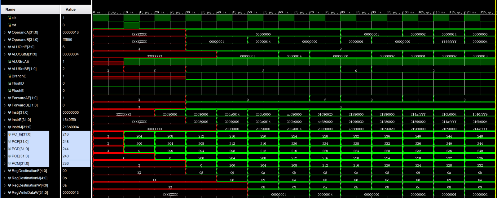

##### data_memory中的计算结果:

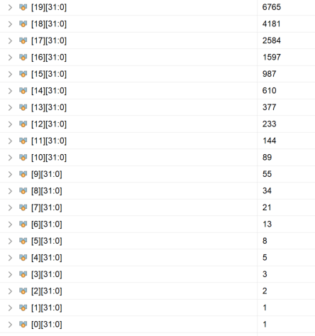

## 实验总结与感想：

1.  通过实验了解了流水线MIPS-CPU的设计实现，了解了流水线MIPS-CPU的简单应用。
2.  复习了Verilog语法，提高了编程实践能力。

