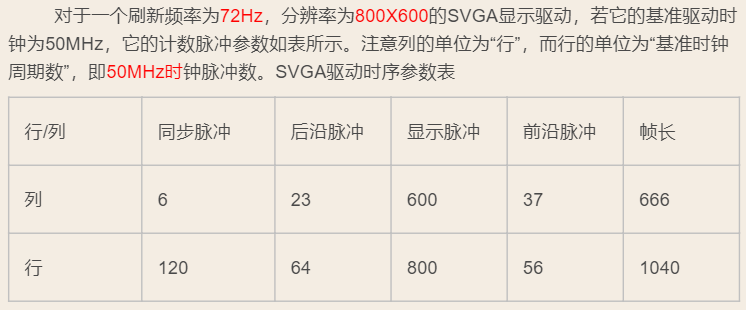
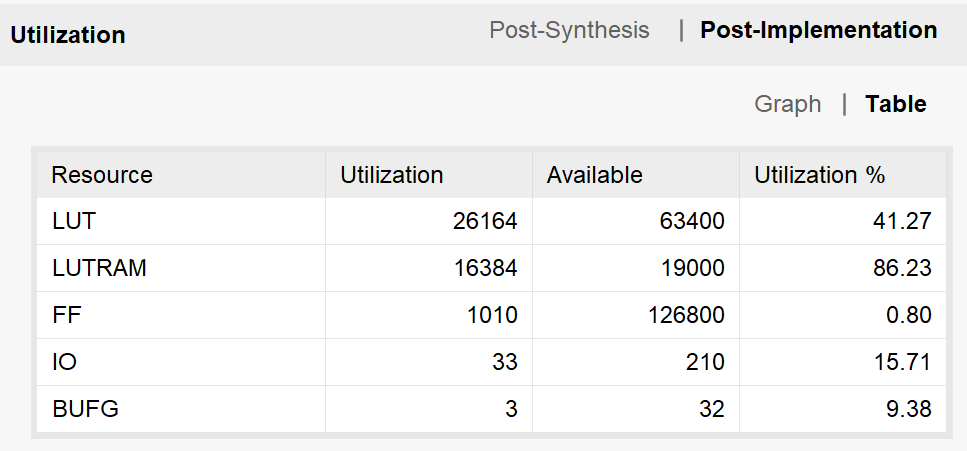
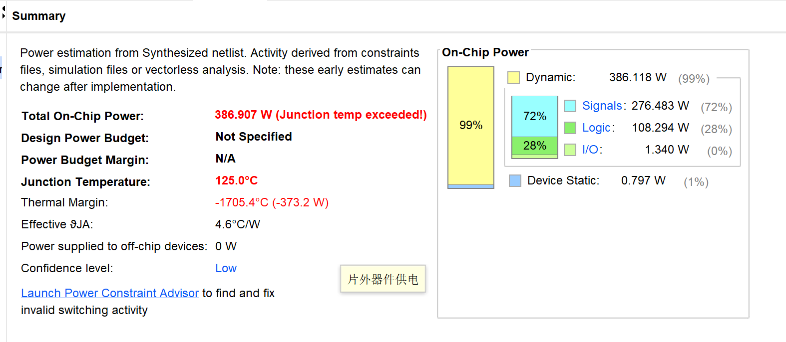
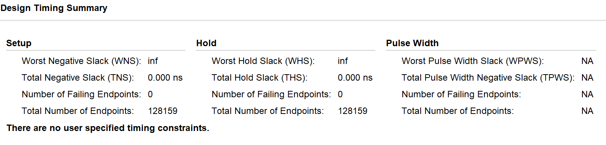

# **计算机组成原理实验报告**

+   **实验题目：存储器与显示控制器 **
+   **实验日期：2019年4月18日**
+   **姓名：张劲暾**
+   **学号：PB16111485**
+   **成绩：**

---

>   IP（Intellectual Property）内核模块是一种预先设计好的甚至已经过验证的具有某种确定功能的集成电路、器件或部件。
>
>   ROM的IP核生成需要初始化文件, 这个初始化的文件后缀是 .coe 
>
>   其中： 
>   	`memory_initialization_radix` 是数值格式 
>   	`memory_initialization_vector` 是初始化的数值向量，分别对应各个深度
>
>   注意：
>
>   *   radix 其实就是进制，下面的 vector 不能出现超过 radix 的数据。 
>   *   因为coe文件最后会被转化为mif文件，即最后都是二进制表示，所以需要考虑好数值范围的问题，否则可能出错，例如 ROM 的数据宽度为 3 ，初始化文件中出现 8 或以上的数据，则可能生成失败，或者只取了低3位。
>
>   

## 实验目的：

1.  控制画笔在800x600分辨率的显示器上随意涂画，画笔的颜色12位(红r绿g蓝b各4位)，绘画区域位于屏幕正中部，大小为256x256

    *   画笔位置(x, y): x = y = 0 ~ 255, 复位时 (128, 128)
    *   移动画笔(dir): 上/下/左/右按钮
    *   画笔颜色(rgb): 12位开关设置
    *   绘画状态(draw): 1-是, 0-否； 处于绘画状态时，移动画笔同时绘制颜色，否则仅移动画笔

2.  `VRAM`：视频存储器，存储256x256个像素的 颜色信息，采用简单双端口存储器实现 

    -   `paddr`, `pdata`, `we`: 地址、数据、写使能，用于绘画 的同步写端口

    - `vaddr`, `vdata`: 地址、数据，用于显示的异步读端口

3.  `PCU`：Paint Control Unit，绘画控制单元， 修改`VRAM`中像素信息 

    -   通过12个拨动开关设置像素颜色 (`rgb`)

    - 通过上/下/左/右(`dir`)按钮开关，移动画笔位置(x, y) 
        *   直角移动：单一按钮按下一次，x或y增加或减小1
        *   对角移动：两按钮同时按下一次，x和y同时加或减1
        *   连续移动：按钮按下超过t秒后，等效为s速率的连续 点击，直至松开（调试时确定合适的t和s取值）
    - 绘画(`draw`=1)时，依据`rgb`和(x, y)，通过写端口(`paddr`,`pdata`,`we`)修改`VRAM`像素信息

4.  `DCU`：Display Control Unit，显示控制单元，显示`VRAM`中像素信息 

    -   通过读端口(`vaddr`, `vdata`)取出`VRAM`信息并显示 
    -   `vrgb`, `hs`, `vs`：显示器接口信号显示模式：分辨率800x600，刷新频率72Hz，像素时钟频率50MHz `VRAM`中的1个像素对应显示屏上1个像素

    - 在屏幕上显示十字光标，指示画笔当前位置 (x, y)

## 实验设计简述与核心代码：

### 顶层单元(VGADrawer.v)

```verilog
module VGADrawer
(
//---------------------------------------------------------------------
    input           clk     ,
    input           rst     ,
    input   [11:0]  rgb     ,
    input   [3:0]   dir     ,
    input           draw    ,
//---------------------------------------------------------------------
    output          hs      ,
    output          vs      ,
    output  [11:0]  vrgb
//---------------------------------------------------------------------    
);
wire [15:0] paddr   ;
wire [11:0] pdata   ;
wire        we      ;
wire [7:0]  x       ;
wire [7:0]  y       ;
wire [15:0] vaddr   ;
wire [11:0] vdata   ;
//---------------------------------------------------------------------
DCU dcu_1
(
    .clk(clk)           ,
    .rst(rst)           ,
    .x(x)               ,
    .y(y)               ,
    .vdata(vdata)       ,
    .hs(hs)             ,
    .vs(vs)             ,
    .red  ( vrgb[ 3:0] ),
    .green( vrgb[ 7:4] ),
    .blue ( vrgb[11:8] ),
    .vaddr(vaddr)
);
//---------------------------------------------------------------------
PCU pcu_1
(
    .clk(clk)       ,
    .rst(rst)       ,
    .rgb(rgb)       ,
    .dir(dir)       ,
    .draw(draw)     ,
    .x(x)           ,
    .y(y)           ,  
    .we(we)         ,
    .paddr(paddr)   ,
    .pdata(pdata)    
);
//---------------------------------------------------------------------
VRAM vram_1
(
    .clk(clk)       ,
    .rst(rst)       ,
    .paddr(paddr)   ,
    .pdata(pdata)   ,
    .we(we)         ,
    .vaddr(vaddr)   ,
    .vdata(vdata)
);
//---------------------------------------------------------------------
endmodule
```

### 视频存储器(VRAM.v)(可以在复位时自动清屏)

```verilog
module VRAM
(
//---------------------------------------------------------------------
    input           clk     ,
    input           rst     ,
    input   [15:0]  paddr   ,
    input   [11:0]  pdata   ,
    input           we      ,
    input   [15:0]  vaddr   ,
//---------------------------------------------------------------------
    output  [11:0]  vdata
//---------------------------------------------------------------------
);
reg  [15:0] a;
wire [11:0] d;
wire we_m;
//---------------------------------------------------------------------
assign we_m = rst ? 1'b1 : we;
always @ (posedge clk) 
    begin
        if (rst)    a[15:0] <= a[15:0] + 16'd1;
        else        a[15:0] <= paddr[15:0];
    end
assign d = rst ? 12'b1111_1111_1111 : pdata[11:0];
//---------------------------------------------------------------------
dist_mem_gen_0 vram_core (
    .a(a),        // input wire [15 : 0] a
    .d(d),        // input wire [11 : 0] d
    .dpra(vaddr),     // input wire [15 : 0] dpra
    .clk(clk),        // input wire clk
    .we(we_m),        // input wire we
    .dpo(vdata)       // output wire [11 : 0] dpo
);
//---------------------------------------------------------------------
endmodule
```

### 绘画控制单元(PCU.v)

```verilog
module PCU
(
//---------------------------------------------------------------------
    input               clk     ,
    input               rst     ,
    input       [11:0]  rgb     ,
    // rgb[ 3:0] := red  [3:0],
    // rgb[ 7:4] := green[3:0],
    // rgb[11:8] := blue [3:0],
    input       [3:0]   dir     ,
    // dir[0] := Up,    dir[1] := Left, 
    // dir[2] := Down,  dir[3] := Right,
    input               draw    ,
//---------------------------------------------------------------------
    output  reg [7:0]   x       ,
    output  reg [7:0]   y       ,
    output              we      ,
    output  reg [15:0]  paddr   ,
    output  reg [11:0]  pdata   
//---------------------------------------------------------------------
);
//---------------------------------------------------------------------
reg         clk_slow    ;   initial clk_slow  =  1'b0;
reg [23:0]  clk_count   ;   initial clk_count = 24'd0;
reg         Pixel_Clk   ;   // 50MHz像素时钟
//---------------------------------------------------------------------
// 产生50MHz像素时钟
always @ (posedge clk)   begin   Pixel_Clk   <=  ~Pixel_Clk  ;   end
//---------------------------------------------------------------------
always @ (posedge Pixel_Clk)
    begin
        if (clk_count == 24'd100_0000 - 24'd1)  
            begin   clk_slow <= 1'b1;   clk_count <= 24'd0;             end
        else                                    
            begin   clk_slow <= 1'b0;   clk_count <= clk_count + 24'd1; end
    end
//---------------------------------------------------------------------
assign we = draw & clk_slow;
//---------------------------------------------------------------------
always @ (posedge clk_slow or posedge rst)
    begin
    //---------------------------------------------------------------------
        if(rst)                 begin   x <= 8'd128;    y <= 8'd128;    end
    //---------------------------------------------------------------------
        else 
            begin
                case (dir)
                    4'b0001:    begin   x <= x + 8'd0;  y <= y - 8'd1;  end // Up
                    4'b0010:    begin   x <= x - 8'd1;  y <= y + 8'd0;  end // Left
                    4'b0100:    begin   x <= x + 8'd0;  y <= y + 8'd1;  end // Down
                    4'b1000:    begin   x <= x + 8'd1;  y <= y + 8'd0;  end // Right
                    4'b1001:    begin   x <= x + 8'd1;  y <= y - 8'd1;  end // UpRight
                    4'b0011:    begin   x <= x - 8'd1;  y <= y - 8'd1;  end // UpLeft
                    4'b0110:    begin   x <= x - 8'd1;  y <= y + 8'd1;  end // DownLeft
                    4'b1100:    begin   x <= x + 8'd1;  y <= y + 8'd1;  end // DownRight
                    default:    begin   x <= x + 8'd0;  y <= y + 8'd0;  end // Illegal
                endcase
            end
    //---------------------------------------------------------------------
        paddr[15:0] <= {y[7:0], x[7:0]} ; 
        pdata[11:0] <= rgb[11:0]        ;
    //---------------------------------------------------------------------
    end
//---------------------------------------------------------------------
endmodule

```

### 显示控制单元(DCU.v)

```verilog
module DCU
(
//---------------------------------------------------------------------
    input               clk     ,
    input               rst     ,
    input       [7:0]   x       ,
    input       [7:0]   y       ,
    input       [11:0]  vdata   ,
//---------------------------------------------------------------------
    output              hs      ,
    output              vs      ,
    output  reg [3:0]   red     ,
    output  reg [3:0]   blue    ,
    output  reg [3:0]   green   ,
    output  reg [15:0]  vaddr   
//---------------------------------------------------------------------
);
//---------------------------------------------------------------------
// 分辨率为800*600，刷新频率72Hz，像素时钟50MHz，行时序参数定义，行的单位是“标准时钟周期”
parameter   Horizontal_Sync_Pulse   =   120 ,   // 行同步宽度
            Horizontal_Back_Porch   =   64  ,   // 行消隐宽度
            Horizontal_Front_Porth  =   56  ,   // 行前肩宽度
            Horizontal_Active_Time  =   800 ,   // 行视频有效宽度
            Horizontal_Line_Period  =   1040;   // 行宽度
//---------------------------------------------------------------------
// 分辨率为800*600，刷新频率72Hz，像素时钟50MHz，场时序参数定义，场的单位是“行周期”
parameter   Vertical_Sync_Pulse     =   6   ,   // 场同步宽度
            Vertical_Back_Porch     =   23  ,   // 场消隐宽度
            Vertical_Front_Porth    =   37  ,   // 场前肩宽度
            Vertical_Active_Time    =   600 ,   // 场视频有效宽度
            Vertical_Frame_Period   =   666 ;   // 场宽度
//---------------------------------------------------------------------
reg [11:0]  H_Count     ;   // 行时序计数器
reg [11:0]  V_Count     ;   // 场时序计数器
reg         Pixel_Clk   ;   // 50MHz像素时钟   
wire        Active_Flag ;   // 显示激活标志
wire        Cross_Sign  ;   // 十字光标区域标志
//--------------------------------------------------------------------------------------------------------------------------
assign  Active_Flag =   
    (H_Count >= (Horizontal_Sync_Pulse  + Horizontal_Back_Porch                              )) && 
    (H_Count <= (Horizontal_Sync_Pulse  + Horizontal_Back_Porch + Horizontal_Active_Time     )) && 
    (V_Count >= (Vertical_Sync_Pulse    + Vertical_Back_Porch                                )) && 
    (V_Count <= (Vertical_Sync_Pulse    + Vertical_Back_Porch   + Vertical_Active_Time       ))  ;
//--------------------------------------------------------------------------------------------------------------------------
assign  Show_Flag =     (H_Count >= (Horizontal_Sync_Pulse  + Horizontal_Back_Porch         ))  &&
                        (H_Count <= (Horizontal_Sync_Pulse  + Horizontal_Back_Porch + 255   ))  &&
                        (V_Count >= (Vertical_Sync_Pulse    + Vertical_Back_Porch           ))  &&
                        (V_Count <= (Vertical_Sync_Pulse    + Vertical_Back_Porch   + 255   ))  ;
//--------------------------------------------------------------------------------------------------------------------------
assign  Cross_Sign  =   (
(H_Count <= (Horizontal_Sync_Pulse + Horizontal_Back_Porch + x + 5   )) &&
(H_Count >= (Horizontal_Sync_Pulse + Horizontal_Back_Porch + x - 5   )) &&
(V_Count == (Vertical_Sync_Pulse   + Vertical_Back_Porch   + y       ))
                        )   ||
                        (  
(H_Count == (Horizontal_Sync_Pulse + Horizontal_Back_Porch + x       )) &&
(V_Count >= (Vertical_Sync_Pulse   + Vertical_Back_Porch   + y - 7   )) &&
(V_Count <= (Vertical_Sync_Pulse   + Vertical_Back_Porch   + y + 7   ))
                        );
//--------------------------------------------------------------------------------------------------------------------------
// 产生50MHz像素时钟
always @ (posedge clk)   begin   Pixel_Clk   <=  ~Pixel_Clk  ;   end
//--------------------------------------------------------------------------------------------------------------------------
// 产生行时序
always @ (posedge Pixel_Clk or posedge rst)
begin
    if (rst)                                            H_Count <=  12'd0           ;
    else if (H_Count == Horizontal_Line_Period - 1'b1)  H_Count <=  12'd0           ;
    else                                                H_Count <=  H_Count + 12'd1 ;
end
//--------------------------------------------------------------------------------------------------------------------------
// 产生场时序
always @ (posedge Pixel_Clk or posedge rst)
begin
    if (rst)                                            V_Count <=  12'd0           ;
    else if (V_Count == Vertical_Frame_Period  - 1'b1)  V_Count <=  12'd0           ;
    else if (H_Count == Horizontal_Line_Period - 1'b1)  V_Count <=  V_Count + 1'b1  ;
    else                                                V_Count <=  V_Count         ;
end
//--------------------------------------------------------------------------------------------------------------------------
assign hs = (H_Count < Horizontal_Sync_Pulse) ? 1'b0 : 1'b1 ;
assign vs = (V_Count < Vertical_Sync_Pulse  ) ? 1'b0 : 1'b1 ;
//--------------------------------------------------------------------------------------------------------------------------
// 产生视频显示
always @ (posedge Pixel_Clk or posedge rst)
begin
    if (rst)                vaddr <= 16'd0;
    else if (Active_Flag)
        begin
            if (Show_Flag)
                begin
                    if (Cross_Sign)
                        begin
                            red   <= 4'b0000        ;   
                            green <= 4'b1111        ;   
                            blue  <= 4'b0000        ;
                            vaddr <= vaddr + 1'b1   ;   
                        end
                    else
                        begin
                            red   <= vdata[ 3:0]    ;   
                            green <= vdata[ 7:4]    ;   
                            blue  <= vdata[11:8]    ;
                            vaddr <= vaddr + 1'b1   ;   
                        end
                end
            else
                begin
                    red     <=  4'b0000 ;
                    green   <=  4'b0000 ;
                    blue    <=  4'b0000 ;
                    vaddr   <=  vaddr   ;
                end
        end
    else
        begin
            red     <=  4'b0000 ;
            green   <=  4'b0000 ;
            blue    <=  4'b0000 ;
            vaddr   <=  vaddr   ;
        end
end
//---------------------------------------------------------------------
endmodule

```

## 实验结果：

### 现场烧录检查：已通过

### 实现资源消耗与性能统计：







### 仿真测试结果：

**因为本实验需要大量降频和视频控制操作(刷新),不便仿真观察结果，故未仿真，现场烧录检查通过，没有任何问题。**

## 实验总结与感想：

1.  通过实验了解了存储器与显示控制器的设计实现，了解了存储器与显示控制器的简单应用。
2.  复习了Verilog语法，提高了编程实践能力。

