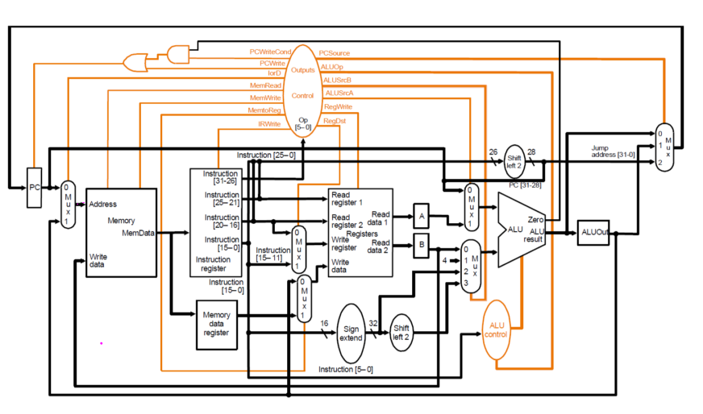
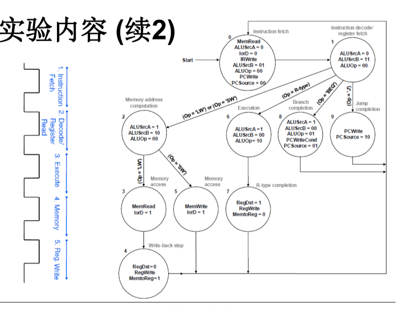
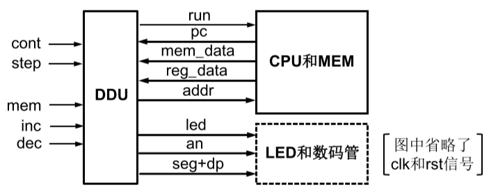
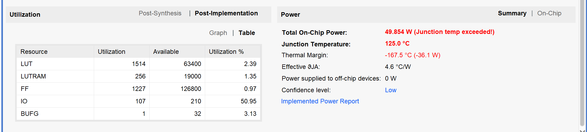
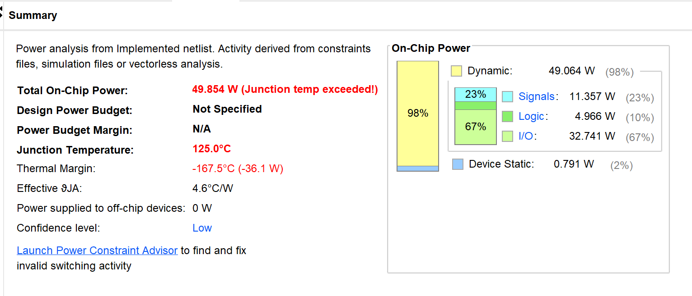
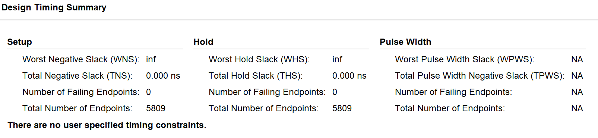
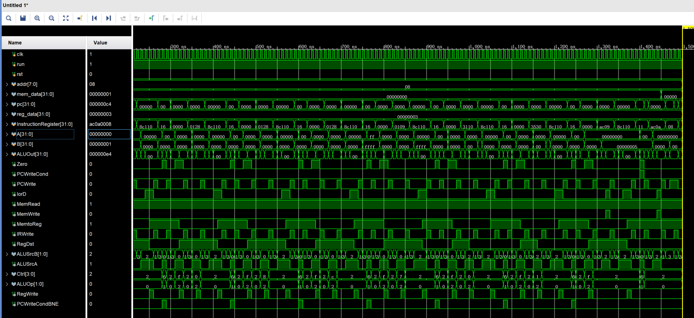

# **计算机组成原理实验报告**

+   **实验题目：多周期MIPS-CPU **
+   **实验日期：2019年5月16日**
+   **姓名：张劲暾**
+   **学号：PB16111485**
+   **成绩：**

---

## 目录

[TOC]

---

## 实验目的：

1.  设计实现多周期MIPS-CPU，可执行如下指令：

    *   `add`, `sub`, `and`, `or`, `xor`, `nor`, `slt`
    *   `addi`, `andi`, `ori`, `xori`, `slti`
    *   `lw`, `sw`
    *   `beq`, `bne`, `j`

    数据通路和控制单元如下，其中寄存器堆中`R0`内容恒定为0，存储器容量为256x32位

    

    

2.  DDU：Debug and Display Unit，调试和显示单元

    *   下载测试时，用于控制CPU运行方式和显示运行结果

    *   数据通路中寄存器堆和存储器均需要增加1个读端口，供DDU读取并显示其中内容

        
        
    *   控制CPU运行方式
    
        -   `cont` = 1：`run` = 1，控制CPU连续执行指令
        -   `cont` = 0：每按动`step`一次，`run`输出维持一个时钟周期的脉冲，控制CPU执行一条指令
    
    *   查看CPU运行状态
    
        -   `mem`： 1，查看MEM；0，查看RF
        -   `inc`/`dec`：增加或减小待查看RF/MEM的地址`addr`
        -   `reg_data`/`mem_data`：从RF/MEM读取的数据
        -   8位数码管显示RF/MEM的一个32位数据
        -   16位LED指示RF/MEM的地址和PC的值

## 实验设计简述与核心代码：

### `DDU`模块设计(DDU.v)

```verilog
module DDU(
//------------------------------------------------------------------------------
    input           clk,
    input           rst,
//------------------------------------------------------------------------------
    input           cont,
    input           step,
    input           mem,
    input           inc,
    input           dec,
    output  [15:0]  led,
    output  [15:0]  seg
//------------------------------------------------------------------------------
    );
//------------------------------------------------------------------------------
wire            run;
reg     [7:0]   addr;
wire    [31:0]  pc;
assign  led = { addr[7:0], pc[7:0] };

wire            step_pos;
reg             step_past1, step_past2, step_stable;
reg     [23:0]  step_count;

wire            inc_pos;
reg             inc_past1, inc_past2, inc_stable;
reg     [23:0]  inc_count;

wire            dec_pos;
reg             dec_past1, dec_past2, dec_stable;
reg     [23:0]  dec_count;

wire    [31:0]  mem_data;
wire    [31:0]  reg_data;
//******************************************************
mipsCPU cpu(
//----------------------------------------------
    /* input                */ .origin_clk(clk),
    /* input                */ .rst(rst),
//----------------------------------------------
    /* input                */ .run(run),
    /* input       [7:0]    */ .addr(addr),
    /* output  reg [31:0]   */ .pc(pc),
    /* output      [31:0]   */ .mem_data(mem_data),
    /* output      [31:0]   */ .reg_data(reg_data)
//----------------------------------------------
    );
//******************************************************
// 获取step、inc、dec的稳定上升沿信号
always @ (posedge clk or posedge rst)
    begin
        if (rst)    
            begin   
                step_count  <= 24'd0;   step_stable <= 1'b0;
                inc_count   <= 24'd0;   inc_stable  <= 1'b0;
                dec_count   <= 24'd0;   dec_stable  <= 1'b0;    
            end
        else
            begin
            //--------------------------------------------------------------------
                if(step)
                    begin
                        if (step_stable) ;
                        else
                            begin
                                step_count <= step_count + 24'd1;
                                if(step_count == 24'd1000_0000)  
                                    begin 
                                        step_stable <= 1'b1; 
                                        step_count  <= 24'd0; 
                                    end
                            end
                    end
                else    begin step_count  <= 24'd0; step_stable = 1'b0; end
            //--------------------------------------------------------------------
                if(inc)
                    begin
                        if (inc_stable) ;
                        else
                            begin
                                inc_count <= inc_count + 24'd1;
                                if(inc_count == 24'd1000_0000)  
                                    begin 
                                        inc_stable <= 1'b1; 
                                        inc_count  <= 24'd0; 
                                    end
                            end 
                    end
                else    begin inc_count  <= 24'd0; inc_stable = 1'b0; end
            //--------------------------------------------------------------------
                if(dec)
                    begin
                        if (dec_stable) ;
                        else
                            begin
                                dec_count <= dec_count + 24'd1;
                                if(dec_count == 24'd1000_0000)  
                                    begin 
                                        dec_stable <= 1'b1; 
                                        dec_count  <= 24'd0; 
                                    end
                            end
                    end
                else    begin dec_count  <= 24'd0; dec_stable = 1'b0; end
            //--------------------------------------------------------------------
            end
    end
//------------------------------------------------------------------------------
always @ (posedge clk or posedge rst)
    begin
        if(rst) 
            begin   
                step_past1 <= 1'b0;         step_past2 <= 1'b0;         
                inc_past1  <= 1'b0;          inc_past2 <= 1'b0;         
                dec_past1  <= 1'b0;          dec_past2 <= 1'b0;         
            end
        else    
            begin   
                step_past1 <= step_stable;  step_past2 <= step_past1;   
                inc_past1  <= inc_stable;   inc_past2  <= inc_past1;   
                dec_past1  <= dec_stable;   dec_past2  <= dec_past1;   
            end
    end
//------------------------------------------------------------------------------
assign step_pos = step_past1 & (~step_past2);
assign inc_pos  = inc_past1  & (~inc_past2);
assign dec_pos  = dec_past1  & (~dec_past2);
assign run = cont | step_pos;
//------------------------------------------------------------------------------
always @ (posedge clk) 
    begin
        if(rst)
            addr <= 0;
        else if(inc_pos)
            addr <= addr + 1;
        else if(dec_pos)
            addr <= addr - 1;
    end 
//------------------------------------------------------------------------------
reg             clk_slow;
reg     [23:0]  clk_count;
reg     [3:0]   number;
reg     [2:0]   position;
//------------------------------------------------------------------------------
always @ (posedge clk)
    begin
        if (clk_count == 24'd1_00_000)  
            begin clk_slow <= 1'b1; clk_count <= 24'b0;             end
        else                            
            begin clk_slow <= 1'b0; clk_count <= clk_count + 24'd1; end
    end
//------------------------------------------------------------------------------
DisplayUnit dpu(
//----------------------------------------------
    /* input       [3:0]  */ .number(number),
    /* input       [2:0]  */ .position(position),
//----------------------------------------------
    /* output  reg [7:0]  */ .sel(seg[7:0]),
    /* output  reg [7:0]  */ .seg(seg[15:8])
//----------------------------------------------
    );
//------------------------------------------------------------------------------
always @ (posedge clk_slow) 
    begin
        position <= position + 3'd1;
    end
//------------------------------------------------------------------------------
always @ (*)
    begin
        if(mem)
            case(position)
                3'b000: number = mem_data[3:0];
                3'b001: number = mem_data[7:4];
                3'b010: number = mem_data[11:8];
                3'b011: number = mem_data[15:12];
                3'b100: number = mem_data[19:16];
                3'b101: number = mem_data[23:20];
                3'b110: number = mem_data[27:24];
                3'b111: number = mem_data[31:28];
            endcase
        else
            case(position)
                3'b000: number = reg_data[3:0];
                3'b001: number = reg_data[7:4];
                3'b010: number = reg_data[11:8];
                3'b011: number = reg_data[15:12];
                3'b100: number = reg_data[19:16];
                3'b101: number = reg_data[23:20];
                3'b110: number = reg_data[27:24];
                3'b111: number = reg_data[31:28];
            endcase
    end
//------------------------------------------------------------------------------
endmodule
```

### `DisplayUnit`模块设计(DisplayUnit.v)

将CPU的输出值显示在数码管的译码模块

```verilog
module DisplayUnit(
//----------------------------------------------
    input       [3:0] number,
    input       [2:0] position,
//----------------------------------------------
    output  reg [7:0] sel,
    output  reg [7:0] seg
//----------------------------------------------
    );
//----------------------------------------------
always @ (*)
    begin
        case(number)
            //                       gfed_cba
            4'b0000: seg[7:0] = 8'b1_1000_000;
            //                       gfed_cba
            4'b0001: seg[7:0] = 8'b1_1111_001;
            //                       gfed_cba
            4'b0010: seg[7:0] = 8'b1_0100_100;
            //                       gfed_cba
            4'b0011: seg[7:0] = 8'b1_0110_000;
            //                       gfed_cba
            4'b0100: seg[7:0] = 8'b1_0011_001;
            //                       gfed_cba
            4'b0101: seg[7:0] = 8'b1_0010_010;
            //                       gfed_cba
            4'b0110: seg[7:0] = 8'b1_0000_010;
            //                       gfed_cba
            4'b0111: seg[7:0] = 8'b1_1111_000;
            //                       gfed_cba
            4'b1000: seg[7:0] = 8'b1_0000_000;
            //                       gfed_cba
            4'b1001: seg[7:0] = 8'b1_0010_000;
            //                       gfed_cba
            4'b1010: seg[7:0] = 8'b1_0001_000;
            //                       gfed_cba
            4'b1011: seg[7:0] = 8'b1_0000_011;
            //                       gfed_cba
            4'b1100: seg[7:0] = 8'b1_1000_110;
            //                       gfed_cba
            4'b1101: seg[7:0] = 8'b1_0100_001;
            //                       gfed_cba
            4'b1110: seg[7:0] = 8'b1_0000_110;
            //                       gfed_cba
            4'b1111: seg[7:0] = 8'b1_0001_110;
        endcase
        case(position)
            3'b000: sel = 8'b1111_1110;
            3'b001: sel = 8'b1111_1101;
            3'b010: sel = 8'b1111_1011;
            3'b011: sel = 8'b1111_0111;
            3'b100: sel = 8'b1110_1111;
            3'b101: sel = 8'b1101_1111;
            3'b110: sel = 8'b1011_1111;
            3'b111: sel = 8'b0111_1111;
        endcase
    end
//----------------------------------------------
endmodule
```

### `mipsCPU`模块设计(mipsCPU.v)

CPU顶层模块

```verilog
module mipsCPU(
//----------------------------------------
    input               origin_clk,
    input               rst,
//----------------------------------------
    input               run,
    input       [7:0]   addr,
    output  reg [31:0]  pc,
    output      [31:0]  mem_data,
    output      [31:0]  reg_data
//----------------------------------------
    );
//----------------------------------------
wire clk;
assign clk = origin_clk & run;
//----------------------------------------
reg [31:0]  InstructionRegister;
reg [31:0]  MemoryDataRegister;
reg [31:0]  ALUOut;
reg [31:0]  A;
reg [31:0]  B;
//===================================
wire        Zero;
wire        PCWriteCond;
wire        PCWrite;
wire [31:0] ALU_result;
wire [31:0] Jump_address;
wire [31:0] Address;
wire        IorD;
wire        MemRead;
wire        MemWrite;
wire [31:0] MemData;
wire [31:0] RegtoA;
wire [31:0] RegtoB;
wire        MemtoReg;
wire        IRWrite;
wire        RegDst;
wire [1:0]  ALUSrcB;
wire        ALUSrcA;
wire [31:0] SourceB;
wire [31:0] SourceA;
wire [4:0]  RegWriteAddr;
wire [31:0] RegWriteData;
wire [3:0]  Ctrl;
wire [1:0]  ALUOp;
wire [1:0]  PCSource;
wire        I_TYPE;

assign I_TYPE = ( InstructionRegister[31:29] == 3'b001 );

assign Jump_address = {pc[31:28], InstructionRegister[25:0], 2'b00};
//===================================
always @(posedge clk or posedge rst)
    begin
        if(rst)
            pc  <= 32'd44;
        else
            begin
                if( PCWrite | ( Zero & PCWriteCond ) | ( ~Zero & PCWriteCondBNE ) )
                    begin
                        case (PCSource)
                            2'b00   : pc <= ALU_result;
                            2'b01   : pc <= ALUOut;
                            2'b10   : pc <= Jump_address;
                            default : pc <= ALU_result;
                        endcase
                    end
            end
    end
//===================================
assign Address      = IorD      ? ALUOut                        : pc;
//===================================
assign RegWriteData = MemtoReg  ? MemoryDataRegister            : ALUOut;
//===================================
assign RegWriteAddr = RegDst    ? InstructionRegister[15:11]    : InstructionRegister[20:16];
//===================================
assign SourceB      =   ALUSrcB[1]      ?       
                        	( ALUSrcB[0]    ? 
             	{ {14{InstructionRegister[15]}}, InstructionRegister[15:0], 2'b00 } 
                                        	: 
              	{ {16{InstructionRegister[15]}}, InstructionRegister[15:0] }
                        	)
                                        :   
                        	( ALUSrcB[0]    ? 32'd4 
                                        	: B 
                        	);
//===================================
assign SourceA      = ALUSrcA ? A   :   pc;
//===================================
always @(posedge clk)
    begin
        MemoryDataRegister  <= MemData;
        A <= RegtoA;
        B <= RegtoB;
        ALUOut <= ALU_result;
        if(IRWrite) InstructionRegister <= MemData;
        else        InstructionRegister <= InstructionRegister;
    end
//===================================
Control ctrl(
    .clk(clk),
    .rst(rst),
    .Op(InstructionRegister[31:26]),
    .RegDst(RegDst),
    .RegWrite(RegWrite),
    .ALUSrcA(ALUSrcA),
    .ALUSrcB(ALUSrcB),
    .ALUOp(ALUOp),
    .PCSource(PCSource),
    .PCWriteCond(PCWriteCond),
    .PCWriteCondBNE(PCWriteCondBNE),
    .PCWrite(PCWrite),
    .IorD(IorD),
    .MemRead(MemRead),
    .MemWrite(MemWrite),
    .MemtoReg(MemtoReg),
    .IRWrite(IRWrite)
);
Memory mem(
    .clk(clk),
    .MemRead(MemRead),
    .MemWrite(MemWrite),
    .Address(Address),
    .WriteData(B),
    .MemData(MemData),
    .addr(addr),
    .mem_data(mem_data)
);
ALUControl alu_ctrl(
    .ALUOp(ALUOp),
    .Func( I_TYPE ? InstructionRegister[31:26] : InstructionRegister[5:0] ),
    .Ctrl(Ctrl)
);
ALU alu(
    .SourceA(SourceA),
    .SourceB(SourceB),
    .Ctrl(Ctrl),
    .ALUOut(ALU_result),
    .Zero(Zero)
);
RegisterFile RF(
    .clk(clk),
    .rst(rst),
    .RegWrite(RegWrite),
    .ReadAddr1(InstructionRegister[25:21]),
    .ReadData1(RegtoA),
    .ReadAddr2(InstructionRegister[20:16]),
    .ReadData2(RegtoB),
    .WriteAddr(RegWriteAddr),
    .WriteData(RegWriteData),
    .addr(addr[4:0]),
    .reg_data(reg_data)
);
//----------------------------------------
endmodule
```

### `Control`模块设计(Control.v)

多周期CPU控制状态机实现

```verilog
module Control(
//----------------------------------------------------------------------------
    input               clk,
    input               rst,
//----------------------------------------------------------------------------
    input       [5:0]   Op,             // 六位操作码
    output  reg         RegDst,         // 选择 rt(1) 或 rd(0) 作为写操作的目的寄存器
    output  reg         RegWrite,       // 寄存器写信号
    output  reg         ALUSrcA,        // 1 - 寄存器，0 - PC
    output  reg [1:0]   ALUSrcB,        
    // 00 - 寄存器，01 - 4，10 - 32位立即数符号扩展，11 - 32位立即数符号扩展左移两位
    output  reg [1:0]   ALUOp,          // ALU控制信号
    output  reg [1:0]   PCSource,       // 00 - PC + 4，01 - Branch，10 - Jump
    output  reg         PCWriteCond,    // Branch
    output  reg         PCWriteCondBNE, // Branch BNE
    output  reg         PCWrite,        // Jump
    output  reg         IorD,           // 指令读取还是数据读写
    output  reg         MemRead,        // 读内存
    output  reg         MemWrite,       // 写内存
    output  reg         MemtoReg,       // 内存到寄存器
    output  reg         IRWrite         // 写IR
//----------------------------------------------------------------------------
    );
//----------------------------------------------------------------------------
parameter   OP_J        = 6'b000_010;
parameter   OP_R_TYPE   = 6'b000_000;

parameter   OP_ADDI     = 6'b001_000;
parameter   OP_SLTI     = 6'b001_010;
parameter   OP_ANDI     = 6'b001_100;
parameter   OP_ORI      = 6'b001_101;
parameter   OP_XORI     = 6'b001_110;

parameter   OP_BEQ      = 6'b000_100;
parameter   OP_BNE      = 6'b000_101;
parameter   OP_LW       = 6'b100_011;
parameter   OP_SW       = 6'b101_011;

parameter   STATE_IF            = 0;
parameter   STATE_ID            = 1;
parameter   STATE_MemAddrGet    = 2;
parameter   STATE_LW_MemAccess  = 3;
parameter   STATE_WB            = 4;
parameter   STATE_SW_MemAccess  = 5;
parameter   STATE_EXE           = 6;
parameter   STATE_R_TYPE_END    = 7;
parameter   STATE_BRANCH        = 8;
parameter   STATE_JUMP          = 9;
parameter   STATE_I_EXE         = 10;
parameter   STATE_START         = 11;
parameter   STATE_I_TYPE_END    = 12;

reg[3:0]    state;
reg[3:0]    next_state;

//always @(posedge clk or posedge rst)
always @(*)
    begin
        if(rst)
            begin
                IorD            <= 1'b0;
                IRWrite         <= 1'b1;
                RegWrite        <= 1'b0;
                MemWrite        <= 1'b0;
                PCWriteCond     <= 1'b0;
                PCWriteCondBNE  <= 1'b0;
                MemRead         <= 1'b1;
                ALUSrcA         <= 1'b0; 
                PCWrite         <= 1'b0;
                ALUOp           <= 2'b00;
                ALUSrcB         <= 2'b01;
                PCSource        <= 2'b00;
            end
        else
            begin
                PCWriteCond     <= (Op == OP_BEQ) & (next_state == STATE_BRANCH);
                PCWriteCondBNE  <= (Op == OP_BNE) & (next_state == STATE_BRANCH);
                
                case (next_state)
                //----------------------------------------------
                    STATE_IF            :
                        begin
                            RegWrite    <= 1'b0;
                            MemWrite    <= 1'b0;                        
                            MemRead     <= 1'b1;
                            ALUSrcA     <= 1'b0;
                            IorD        <= 1'b0;
                            IRWrite     <= 1'b1;
                            PCWrite     <= 1'b1;
                            ALUOp       <= 2'b00;
                            ALUSrcB     <= 2'b01;
                            PCSource    <= 2'b00;
                        end
                //----------------------------------------------
                    STATE_ID            :
                        begin
                            RegWrite    <= 1'b0;
                            MemWrite    <= 1'b0;
                            IRWrite     <= 1'b0;
                            PCWrite     <= 1'b0;
                            ALUSrcA     <= 1'b0;
                            ALUSrcB     <= 2'b11;
                            ALUOp       <= 2'b00;
                        end
                //----------------------------------------------
                    STATE_MemAddrGet    :
                        begin
                            RegWrite    <= 1'b0;
                            MemWrite    <= 1'b0;
                            IRWrite     <= 1'b0;
                            PCWrite     <= 1'b0;
                            ALUSrcA     <= 1'b1;
                            ALUSrcB     <= 2'b10;
                            ALUOp       <= 2'b00;
                        end
                //----------------------------------------------
                    STATE_LW_MemAccess  :
                        begin
                            RegWrite    <= 1'b0;
                            MemWrite    <= 1'b0;
                            IRWrite     <= 1'b0;
                            PCWrite     <= 1'b0;
                            MemRead     <= 1'b1;
                            IorD        <= 1'b1;
                        end
                //----------------------------------------------
                    STATE_WB            :
                        begin
                            MemWrite    <= 1'b0;
                            IRWrite     <= 1'b0;
                            PCWrite     <= 1'b0;
                            RegDst      <= 1'b0;
                            RegWrite    <= 1'b1;
                            MemtoReg    <= 1'b1;
                        end
                //----------------------------------------------
                    STATE_SW_MemAccess  :
                        begin
                            RegWrite    <= 1'b0;
                            IRWrite     <= 1'b0;
                            PCWrite     <= 1'b0;
                            MemWrite    <= 1'b1;
                            IorD        <= 1'b1;
                        end
                //----------------------------------------------
                    STATE_EXE           :
                        begin
                            RegWrite    <= 1'b0;
                            MemWrite    <= 1'b0;
                            IRWrite     <= 1'b0;
                            PCWrite     <= 1'b0;
                            ALUSrcA     <= 1'b1;
                            ALUSrcB     <= 2'b00;
                            ALUOp       <= 2'b10;
                        end
                //----------------------------------------------
                    STATE_R_TYPE_END    :
                        begin
                            MemWrite    <= 1'b0;
                            IRWrite     <= 1'b0;
                            PCWrite     <= 1'b0;
                            RegDst      <= 1'b1;
                            RegWrite    <= 1'b1;
                            MemtoReg    <= 1'b0;
                        end
                //----------------------------------------------
                    STATE_BRANCH        :
                        begin
                            RegWrite    <= 1'b0;
                            MemWrite    <= 1'b0;
                            IRWrite     <= 1'b0;
                            PCWrite     <= 1'b0;
                            ALUSrcA     <= 1'b1;
                            ALUSrcB     <= 2'b00;
                            ALUOp       <= 2'b01;
                            PCSource    <= 2'b01;
                        end
                //----------------------------------------------
                    STATE_JUMP          :
                        begin
                            RegWrite    <= 1'b0;
                            MemWrite    <= 1'b0;
                            IRWrite     <= 1'b0;
                            PCWrite     <= 1'b1;
                            PCSource    <= 2'b10;
                        end
                //----------------------------------------------
                    STATE_I_EXE         :
                        begin
                            RegWrite    <= 1'b0;
                            MemWrite    <= 1'b0;
                            IRWrite     <= 1'b0;
                            PCWrite     <= 1'b0;
                            ALUSrcA     <= 1'b1;
                            ALUSrcB     <= 2'b10;
                            ALUOp       <= 2'b10;
                        end
                    STATE_I_TYPE_END    :
                        begin
                            MemWrite    <= 1'b0;
                            IRWrite     <= 1'b0;
                            PCWrite     <= 1'b0;
                            RegDst      <= 1'b0;
                            RegWrite    <= 1'b1;
                            MemtoReg    <= 1'b0;
                        end
                //----------------------------------------------

                endcase
            end
    end
always @(state)
    begin
        case (state)
        //-----------------------------------------------------------------------
            STATE_START         :   next_state <= STATE_IF;
        //-----------------------------------------------------------------------
            STATE_IF            :   next_state <= STATE_ID;
        //-----------------------------------------------------------------------
            STATE_ID            :
                begin
                    case (Op)
                        OP_LW       : next_state <= STATE_MemAddrGet;
                        OP_SW       : next_state <= STATE_MemAddrGet;
                        OP_R_TYPE   : next_state <= STATE_EXE;
                        OP_BEQ      : next_state <= STATE_BRANCH;
                        OP_BNE      : next_state <= STATE_BRANCH;
                        OP_J        : next_state <= STATE_JUMP;
                        OP_ADDI     : next_state <= STATE_I_EXE;
                        OP_ANDI     : next_state <= STATE_I_EXE;
                        OP_ORI      : next_state <= STATE_I_EXE;
                        OP_SLTI     : next_state <= STATE_I_EXE;
                        OP_XORI     : next_state <= STATE_I_EXE;
                        default     : next_state <= STATE_IF;
                    endcase
                end
        //-----------------------------------------------------------------------
            STATE_MemAddrGet    :
                begin
                    case (Op)
                        OP_LW       : next_state <= STATE_LW_MemAccess;
                        OP_SW       : next_state <= STATE_SW_MemAccess;
                        default     : next_state <= STATE_IF;
                    endcase
                end
        //-----------------------------------------------------------------------
            STATE_LW_MemAccess  :   next_state <= STATE_WB;
        //-----------------------------------------------------------------------
            STATE_WB            :   next_state <= STATE_IF;
        //-----------------------------------------------------------------------
            STATE_SW_MemAccess  :   next_state <= STATE_IF;
        //-----------------------------------------------------------------------
            STATE_EXE           :   next_state <= STATE_R_TYPE_END;
        //-----------------------------------------------------------------------
            STATE_R_TYPE_END    :   next_state <= STATE_IF;
        //-----------------------------------------------------------------------
            STATE_BRANCH        :   next_state <= STATE_IF;
        //-----------------------------------------------------------------------
            STATE_JUMP          :   next_state <= STATE_IF;
        //-----------------------------------------------------------------------
            STATE_I_EXE         :   next_state <= STATE_I_TYPE_END;
        //-----------------------------------------------------------------------
            STATE_I_TYPE_END    :   next_state <= STATE_IF;
        //-----------------------------------------------------------------------
            default             :   next_state <= STATE_IF;
        //-----------------------------------------------------------------------
        endcase
    end
//-----------------------------------------------------------------------
always @(posedge clk or posedge rst)
    begin
        if(rst) state = STATE_START;
        else    state = next_state;
    end
//-----------------------------------------------------------------------
endmodule
```

### `Memory`模块设计(Memory.v)

数据和指令存储器

```verilog
module Memory(
//----------------------------------------
    input               clk,
//----------------------------------------
    input               MemRead,
    input               MemWrite,
    input       [31:0]  Address,
    input       [31:0]  WriteData,
    output      [31:0]  MemData,
//----------------------------------------
//  input       [31:0]  addr,
    input       [7:0]   addr,
    output      [31:0]  mem_data
//----------------------------------------
    );
//----------------------------------------
dist_mem_gen_0 mem (
  .a(Address[9:2]),                 // input wire [7 : 0] a
  .d(WriteData),                    // input wire [31 : 0] d
  .dpra( { 2'b00, addr[7:2] } ),    // input wire [7 : 0] dpra
  .clk(clk),                        // input wire clk
  .we(MemWrite),                    // input wire we
  .spo(MemData),                    // output wire [31 : 0] spo
  .dpo(mem_data)                    // output wire [31 : 0] dpo
);
//----------------------------------------
endmodule
```

### `RegisterFile`模块设计(RegisterFile.v)

寄存器文件

```verilog
module RegisterFile(
//----------------------------------------
    input               clk,
    input               rst,
//----------------------------------------
    input               RegWrite,
    input       [4:0]   ReadAddr1,
    output      [31:0]  ReadData1,
    input       [4:0]   ReadAddr2,
    output      [31:0]  ReadData2,
    input       [4:0]   WriteAddr,
    input       [31:0]  WriteData,
//----------------------------------------
    input       [4:0]   addr,
    output      [31:0]  reg_data
//----------------------------------------
    );
//----------------------------------------
reg [31:0]  registers[0:31];
assign ReadData1 = registers[ReadAddr1];
assign ReadData2 = registers[ReadAddr2];
assign reg_data  = registers[addr];
integer i;
//----------------------------------------
always@(posedge clk or posedge rst)
    begin
        if(rst) for (i = 0; i < 32; i = i + 1)  begin registers[i][31:0] <= 32'd0;          end
        else    if(RegWrite)                    begin registers[WriteAddr] <= WriteData;    end
    end
//----------------------------------------
endmodule
```

### `ALUInst`参数设定(ALUInst.v)

算数逻辑运算参数设定

```verilog
`define ALU_AND 4'b0000
`define ALU_OR  4'b0001
`define ALU_ADD 4'b0010
`define ALU_SUB 4'b0110
`define ALU_LT  4'b0111
`define ALU_NOR 4'b1100

`define ALU_XOR 4'b1000

`define FUNC_ADD    6'b100_000
`define FUNC_SUB    6'b100_010
`define FUNC_SLT    6'b101_010
`define FUNC_AND    6'b100_100
`define FUNC_OR     6'b100_101
`define FUNC_XOR    6'b100_110
`define FUNC_NOR    6'b100_111

`define FUNC_ADDI   6'b001_000
`define FUNC_SLTI   6'b001_010
`define FUNC_ANDI   6'b001_100
`define FUNC_ORI    6'b001_101
`define FUNC_XORI   6'b001_110
```

### `ALUControl`模块设计(ALUControl.v)

算术逻辑运算控制模块

```verilog
`include "ALUInst.v"
module ALUControl(
//----------------------------------------
    input       [1:0]   ALUOp,
    input       [5:0]   Func,
    output  reg [3:0]   Ctrl
//----------------------------------------
    );
//----------------------------------------
always@(*) 
begin
    case (ALUOp)
        2'b00   :
        //----------------------------------------
            begin
                Ctrl <= `ALU_ADD;
            end
        //----------------------------------------
        2'b01   :
        //----------------------------------------
            begin
                Ctrl <= `ALU_SUB;
            end
        //----------------------------------------
        2'b10   :
            begin
                case (Func)
                
                    `FUNC_ADD   : Ctrl <= `ALU_ADD;
                    `FUNC_SUB   : Ctrl <= `ALU_SUB;
                    `FUNC_SLT   : Ctrl <= `ALU_LT;
                    `FUNC_AND   : Ctrl <= `ALU_AND;
                    `FUNC_OR    : Ctrl <= `ALU_OR;
                    `FUNC_XOR   : Ctrl <= `ALU_XOR;
                    `FUNC_NOR   : Ctrl <= `ALU_NOR;

                    `FUNC_ADDI  : Ctrl <= `ALU_ADD;
                    `FUNC_SLTI  : Ctrl <= `ALU_LT;
                    `FUNC_ANDI  : Ctrl <= `ALU_AND;
                    `FUNC_ORI   : Ctrl <= `ALU_OR;
                    `FUNC_XORI  : Ctrl <= `ALU_XOR;

                    default     : Ctrl <= 4'b1111;
                endcase
            end
        //----------------------------------------
        default :   Ctrl <= 4'b1111;
        //----------------------------------------
    endcase
end
//----------------------------------------
endmodule
```

### `ALU`模块设计(ALU.v)

算术逻辑运算模块

```verilog
`include "ALUInst.v"

module ALU(
//----------------------------------------
    input       [31:0]  SourceA,
    input       [31:0]  SourceB,
    input       [3:0]   Ctrl,
    output  reg [31:0]  ALUOut,
    output              Zero    //
//----------------------------------------
    );
//----------------------------------------
assign Zero = (ALUOut == 0);
always@(*)
    begin
        case (Ctrl)
            `ALU_AND    : ALUOut <= SourceA & SourceB;
            `ALU_OR     : ALUOut <= SourceA | SourceB;
            `ALU_ADD    : ALUOut <= SourceA + SourceB;
            `ALU_SUB    : ALUOut <= SourceA - SourceB;
            `ALU_LT     : ALUOut <= SourceA < SourceB;
            `ALU_NOR    : ALUOut <= ~(SourceA | SourceB);
            `ALU_XOR    : ALUOut <= SourceA ^ SourceB;
            default     : ALUOut <= 32'b0;
        endcase
    end
//----------------------------------------
endmodule
```

## 实验结果：

### 现场烧录检查：已通过

### 实现资源消耗与性能统计：







### 仿真测试结果：

**仿真设计：(cpu_sim.v)**

```verilog
module cpu_sim();
/**
module mipsCPU(
//----------------------------------------
    input               origin_clk,
    input               rst,
//----------------------------------------
    input               run,
    input       [7:0]   addr,
    output  reg [31:0]  pc,
    output  reg [31:0]  mem_data,
    output  reg [31:0]  reg_data
//----------------------------------------
    );
**/
reg         clk, run, rst;
reg [7:0]   addr;
wire [31:0] mem_data;
wire [31:0] pc;
wire [31:0] reg_data;
mipsCPU cpu(
    .origin_clk(clk),
    .rst(rst),
    .run(run),
    .addr(addr),
    .pc(pc),
    .mem_data(mem_data),
    .reg_data(reg_data)
);
initial clk = 1;
initial rst = 0;
initial addr = 8'd8;
initial run = 1'b1;
always 
    begin 
        #5 clk = ~clk; 
    end
initial 
    begin
        #10 rst = 1;  
        #10 rst = 0;
    end

endmodule
```

**结果正确：**



## 实验总结与感想：

1.  通过实验了解了多周期MIPS-CPU的设计实现，了解了多周期MIPS-CPU的简单应用。
2.  复习了Verilog语法，提高了编程实践能力。

