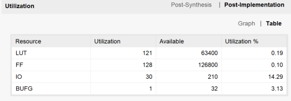
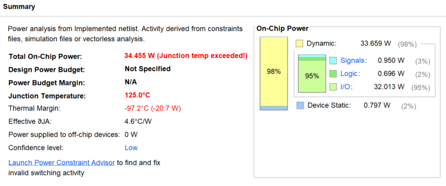
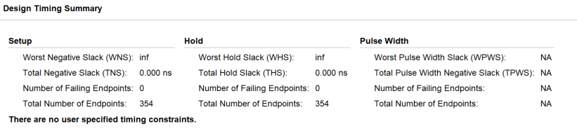

# **计算机组成原理实验报告**

+   **实验题目：寄存器堆与计数器  **
+   **实验日期：2019年4月11日**
+   **姓名：张劲暾**
+   **学号：PB16111485**
+   **成绩：**

---

## 实验目的：

1.   寄存器堆(`Register File`)
    *   `ra0`,`rd0`,`ra1`,`rd1`: 2个异步读端口
    *   `wa`,`wd`,`we`: 1个同步写端口
2.   计数器（Counter）
    *   `ce`：计数使能，1: q=q+1
    *   `pe`：同步装数使能，1: q=d
    *   `rst`：异步清零，1: q=0
3.   最大长度为8的FIFO循环队列：用寄存器堆和适当逻辑实现
    *   `en_out`, `en_in`：出/入队列使能，一次有效仅允许操作一项数据
    *   `out`, `in`：出/入队列数据
    *   `full`, `empty`：队列空/满，空/满时忽略出/入队操作
    *   `display`：8个数码管的控制信号，显示队列状态

## 实验设计简述与核心代码：

### 计数器设计(Counter.v)

```verilog

module Counter(
    input ce,
    input pe,
    input rst,
    input clk,
    input [23:0] d,
    output reg [23:0] q
    );
always @( posedge clk or posedge rst) 
    begin
        if(rst)         q <= 24'b0;
        else if (pe)    q <= d;
        else if (ce)    q <= q + 24'd1;
        else            q <= q;
    end
endmodule
```

### 数码管控制单元设计(DisplayUnit.v)

```verilog
module DisplayUnit(
    input validFlag,
    input [3:0] number,
    input [2:0] position,
    input headdot,
    output reg [7:0] sel,
    output reg [7:0] seg
    );
always @ (*)
    begin
        seg[7] = ~headdot;
        if(~validFlag)
            seg[6:0] = 7'b1111_111;
        else
            begin
                case(number)
                    //                     gfed_cba
                    4'b0000: seg[6:0] = 7'b1000_000;
                    //                     gfed_cba
                    4'b0001: seg[6:0] = 7'b1111_001;
                    //                     gfed_cba
                    4'b0010: seg[6:0] = 7'b0100_100;
                    //                     gfed_cba
                    4'b0011: seg[6:0] = 7'b0110_000;
                    //                     gfed_cba
                    4'b0100: seg[6:0] = 7'b0011_001;
                    //                     gfed_cba
                    4'b0101: seg[6:0] = 7'b0010_010;
                    //                     gfed_cba
                    4'b0110: seg[6:0] = 7'b0000_010;
                    //                     gfed_cba
                    4'b0111: seg[6:0] = 7'b1111_000;
                    //                     gfed_cba
                    4'b1000: seg[6:0] = 7'b0000_000;
                    //                     gfed_cba
                    4'b1001: seg[6:0] = 7'b0010_000;
                    //                     gfed_cba
                    4'b1010: seg[6:0] = 7'b0001_000;
                    //                     gfed_cba
                    4'b1011: seg[6:0] = 7'b0000_011;
                    //                     gfed_cba
                    4'b1100: seg[6:0] = 7'b1000_110;
                    //                     gfed_cba
                    4'b1101: seg[6:0] = 7'b0100_001;
                    //                     gfed_cba
                    4'b1110: seg[6:0] = 7'b0000_110;
                    //                     gfed_cba
                    4'b1111: seg[6:0] = 7'b0001_110;
                endcase
            end
        
        case(position)
            3'b000: sel = 8'b1111_1110;
            3'b001: sel = 8'b1111_1101;
            3'b010: sel = 8'b1111_1011;
            3'b011: sel = 8'b1111_0111;
            3'b100: sel = 8'b1110_1111;
            3'b101: sel = 8'b1101_1111;
            3'b110: sel = 8'b1011_1111;
            3'b111: sel = 8'b0111_1111;
        endcase
    end
endmodule

```

### FIFO循环队列单元设计(FIFO_CircleQueue.v)

```verilog
module FIFO_CircleQueue(
    input clk,
    input rst,
    input en_in,
    input en_out,
    input [3:0] in,
    output full,
    output empty,
    output [3:0] out,
    output [15:0] display
    );
//========================================================================
reg [3:0] tail;
reg [3:0] head;
reg [7:0] valid;
//========================================================================
RegisterFile rf(
    .clk( clk ),
    .rst( rst ),
    .ra0( head ),
    .ra1( position ),
    .wa( tail ),
    .wd( in ),
    .we( en_in_pos && ~full),
    .rd0( out ),
    .rd1( number )
);
//========================================================================
wire en_in_pos, en_out_pos;
reg en_in_stable, en_out_stable;
reg [23:0] en_in_count;
reg [23:0] en_out_count;
always @ (posedge clk or posedge rst)
    begin
        if (rst)
            begin
                en_in_count  <= 20'd0;  en_out_count <= 20'd0;
                en_in_stable <= 1'b0;   en_out_stable <= 1'b0;
            end
        else
            begin
                if(en_in)
                    begin
                        if (en_in_stable) ;
                        else
                            begin
                                en_in_count  <= en_in_count  + 20'd1;
                                if(en_in_count == 24'd1000_0000)  
                                    begin en_in_stable = 1'b1; en_in_count <= 20'd0; end
                            end
                    end
                else    begin en_in_count  <= 20'd0; en_in_stable = 1'b0; end
                if(en_out)
                    begin
                        if (en_out_stable) ;
                        else
                            begin
                                en_out_count  <= en_out_count  + 20'd1;
                                if(en_out_count == 24'd1000_0000)  
                                    begin en_out_stable = 1'b1; en_out_count <= 20'd0; end
                            end
                    end
                else    begin en_out_count  <= 20'd0; en_out_stable <= 1'b0; end
            end
    end
reg en_in_past1, en_in_past2, en_out_past1, en_out_past2;
always @ (posedge clk or posedge rst)
    begin
        if(rst)
            begin
                en_in_past1 <= 1'b0;    en_in_past2 <= 1'b0;
                en_out_past1 <= 1'b0;   en_out_past2 <= 1'b0;
            end
        else
            begin
                en_in_past1 <= en_in_stable;    en_in_past2 <= en_in_past1;
                en_out_past1 <= en_out_stable;  en_out_past2 <= en_out_past1;
            end
    end
assign en_in_pos  = en_in_past1  & (~en_in_past2);
assign en_out_pos = en_out_past1 & (~en_out_past2);
//========================================================================
assign empty = ( valid == 8'b0000_0000 );
assign full  = ( valid == 8'b1111_1111 );
//========================================================================
always @ (posedge clk or posedge rst)
    begin
        if(rst)
            begin
                head  = 4'b0;
                tail  = 4'b0;
                valid = 8'b0;
            end
        else if(en_in_pos && ~full)
            begin
                valid[ tail ] = 1'b1;
                tail = (tail + 4'd1) % 8;
            end
        else if (en_out_pos && ~empty)
            begin
                valid[ head ] = 1'b0;
                head = (head + 4'd1) % 8;
            end
        else
            begin
                head  = head;
                tail  = tail;
                valid = valid;
            end
    end
//========================================================================
reg clk_slow;
wire [23:0] c3_count;
wire headdot;   assign headdot = position == head;
wire [3:0] number;
reg [2:0] position;
reg c3_rst;
Counter c3(
    .ce(1'b1),
    .pe(1'b0),
    .rst(c3_rst),
    .clk(clk),
    .d(24'd0),
    .q(c3_count)
);
always @ (posedge clk)
    begin
        if (c3_count == 24'd1_00_000)   begin clk_slow <= 1'b1; c3_rst <= 1'b1; end
        else                            begin clk_slow <= 1'b0; c3_rst <= 1'b0; end
    end
DisplayUnit d(
    .validFlag( valid[position] ),
    .number(number),
    .position(position),
    .headdot(headdot),
    .sel(display[ 7:0]),
    .seg(display[15:8])
);
always @ (posedge clk_slow) 
    begin
        position <= position + 3'd1;
    end
//========================================================================
endmodule

```

### 寄存器文件单元设计(RegisterFile.v)

```verilog
module RegisterFile(
    input clk,
    input rst,
    input [2:0] ra0,
    input [2:0] ra1,
    input [2:0] wa,
    input [3:0] wd,
    input we,
    output [3:0] rd0,
    output [3:0] rd1
    );
reg [3:0] RegFile[7:0];
integer i;
always @ (posedge clk or posedge rst)
    begin
      if(rst)       for (i = 0; i < 8; i = i + 1) begin RegFile[i][3:0] <= 4'b0; end
      else if(we)   RegFile[wa][3:0] <= wd;
      else          RegFile[wa][3:0] <= RegFile[wa][3:0];
    end
assign rd0 = RegFile[ra0];
assign rd1 = RegFile[ra1];

endmodule
```

## 实验结果：

### 现场烧录检查：已通过

### 实现资源消耗与性能统计：

#### FIFO循环队列







### 仿真测试结果：

**因为FIFO循环队列模块加了使能去抖动，不便模拟(否则需要改动很多地方)，Counter和RegisterFile单元简单，且现场下载检验没有任何问题，故未进行仿真测试**

## 实验总结与感想：

1.  通过实验了解了数据通路与状态机的设计实现，了解了寄存器堆与计数器的简单应用。
2.  复习了Verilog语法，提高了编程实践能力。